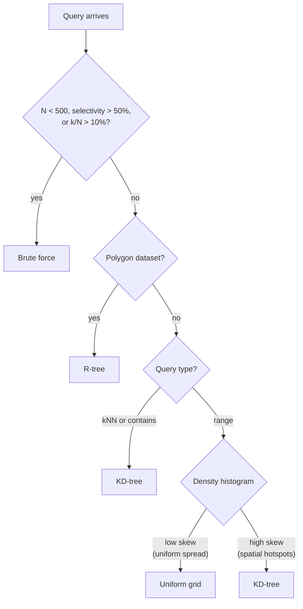

<p align="center">
  
</p>

<p align="center">
  <a href="https://pypi.org/project/pycanopy/"></a>
  <a href="https://pypi.org/project/pycanopy/"></a>
  <a href="https://github.com/pranav-walimbe/pycanopy/actions/workflows/CI.yml"></a>
  <a href="LICENSE"></a>
</p>

<p align="center">A spatial query layer for Polars. Rust core, Python API.</p>

---

> [!NOTE]
> Highly competitive on [Apache SpatialBench](https://github.com/apache/sedona-spatialbench) (single node spatial query benchmark): fastest on 7/12 queries at SF1 and 5/12 at SF10 despite never leaving Polars-like syntax

<p align="center">
  
</p>
<p align="center"><sub>Apache SpatialBench SF1 · lower is better · bars past the cap truncated with their value · TIMEOUT / ERROR annotated</sub></p>

---

## Installation

```bash
pip install pycanopy
```

> Pre-built wheels for Linux, macOS, and Windows. No Rust toolchain required.

```python
import polars as pl
from pycanopy import SpatialFrame

sf = SpatialFrame(pl.read_parquet("cities.parquet"), x_col="lon", y_col="lat")
result = sf.lazy().filter(pl.col("population") > 100_000).range_query(-10.0, 35.0, 40.0, 70.0).collect()
```

---

## Why PyCanopy

No other spatial engine gives you all three at once:

- Polars-native API (no SQL, no conversion)
- Intelligent spatial indexing (the engine decides index type and when to build it)
- A query planner that understands spatial operations (reorders predicates, fuses filters, pushes projections)

How the options compare:

|                                                   | PyCanopy | GeoPandas      | DuckDB spatial | SedonaDB | Spatial Polars |
|:--------------------------------------------------|:--------:|:--------------:|:--------------:|:--------:|:--------------:|
| Polars-native, no SQL or conversion               | ✓        | ✗              | ✗ (SQL)        | ✗ (SQL)       | ✓                    |
| Spatial query planner (reorder, fuse, pushdown)   | ✓        | ✗              | ✗ (spatial join operator, no predicate reordering) | ✓ (SQL/Spark) | ✗ (Polars optimizer) |
| Index vs scan decided by cost model               | ✓        | ✗              | ✗              | ✗             | ✗                    |
| Adaptive index selection based on query profile   | ✓        | ✗ (STRtree)    | ✗ (R-tree)     | ✗ (Quadtree)  | ✗ (STRtree / KDTree) |

---

## Operations

**Point datasets**

| Operation              | Call                                                  | Returns                                          |
|:-----------------------|:------------------------------------------------------|:-------------------------------------------------|
| Range query            | `.range_query(min_x, min_y, max_x, max_y)`            | Rows inside the bounding box                      |
| Range filter           | `.range_filter(min_x, min_y, max_x, max_y)`           | New SpatialFrame with only rows inside the bounding box |
| k-nearest neighbours   | `.knn(x, y, k)`                                        | The `k` rows nearest a point                      |
| kNN join               | `.knn_join(df, x_col, y_col, k)`                       | The `k` nearest rows for each query point         |
| Within-distance join   | `.within_distance_join(df, x_col, y_col, distance)`   | Rows within `distance` of each query point        |
| Convex-hull area       | `SpatialFrame.convex_hull_area(xs, ys)`               | Area of the convex hull of a point set            |
| Batch convex-hull area | `Engine.group_convex_hull_areas(xs_series, ys_series)` | Convex hull area for each group, given Polars `List[Float64]` columns |
| WKB point distance     | `wkb_point_distance(series_a, series_b)`              | Euclidean distance between two WKB point columns  |

**Polygon datasets**

| Operation                     | Call                                                          | Returns                                                 |
|:------------------------------|:-------------------------------------------------------------|:--------------------------------------------------------|
| Point in polygon              | `.contains(x, y)`                                            | Polygons that contain the point                         |
| MBR range                     | `.range_query(min_x, min_y, max_x, max_y)`                  | Polygons whose bounding box meets the query box         |
| Range filter                  | `.range_filter(min_x, min_y, max_x, max_y)`                 | New SpatialFrame with only polygons intersecting the bounding box |
| Within join                   | `.within_join(df, x_col, y_col)`                            | Polygons that contain each query point                  |
| Point-to-polygon distance join   | `.polygon_within_distance_join(df, x_col, y_col, distance)` | Polygons within `distance` of each query point          |
| Point-to-polygon kNN join        | `.polygon_knn_join(df, x_col, y_col, k)`                    | The `k` nearest polygons for each query point           |
| Intersects self-join          | `.intersects_pairs(key_col=None)`                           | Intersecting polygon pairs with overlap area and IoU; `key_col` replaces positional indices with values from that column |
| Area                          | `.polygon_areas()`                                          | Area of each polygon                                    |
| Points near a polygon         | `.points_within_distance_of_polygon(polygon, distance)`     | Points within `distance` of a single polygon            |

**Reductions and streaming** (compose with any join)

| Operation              | Call                                                       | Returns                                                       |
|:-----------------------|:-----------------------------------------------------------|:-------------------------------------------------------------|
| Aggregate-join         | `.group_by(keys).agg(pc.agg.count/sum/mean/min/max(...))`  | One row per group, reduced over the join with no pair frame   |
| Projection pushdown    | `.select(cols)`                                            | Narrows both join sides before the gather                     |
| Stream in batches      | `.collect_batched()`                                       | An iterator of result morsels, bounded memory                |
| Stream to Parquet      | `.sink_parquet(path)`                                      | Writes the result to disk in bounded memory                  |
| Out-of-core pipeline   | `.lazy_source()`                                           | A Polars source that fuses join + sort + sink, spilling to disk |

---

## Usage

### Point dataset: range and KNN

```python
import polars as pl
from pycanopy import SpatialFrame

df = pl.read_parquet("cities.parquet")
sf = SpatialFrame(df, x_col="lon", y_col="lat")

# Bounding-box filter combined with a scalar predicate.
# Optimizer places the scalar filter first, then runs the range query
# on the reduced row set.
result = (
    sf.lazy()
    .filter(pl.col("population") > 100_000)
    .range_query(min_x=-10.0, min_y=35.0, max_x=40.0, max_y=70.0)
    .collect()
)

# k-nearest neighbours
nearest = sf.lazy().knn(x=2.35, y=48.85, k=5).collect()
```

### Inspecting the plan

```python
# Declare ops in any order. explain() shows what the optimizer will actually run.
lf = (
    sf.lazy()
    .range_query(min_x=-10.0, min_y=35.0, max_x=40.0, max_y=70.0)
    .filter(pl.col("population") > 100_000)
)

print(lf.explain())
# RANGE_QUERY [(-10, 35) → (40, 70)]
# FROM
#   FILTER [(col("population")) > (dyn int: 100000)]
#   FROM
#     DF [N=100,000; path: EXPR]
```

The optimizer flipped the declaration order. The scalar filter runs first on all rows, then the spatial query runs on the smaller survivor set. Plans follow Polars' FROM-chain convention, so the bottom runs first and the top is the final result.

### Aggregate over a join

```python
import pycanopy as pc

# Count trips per zone and average their fare, reduced over a streamed
# point-in-polygon join. The full pair frame is never materialised: each
# morsel reduces to per-group partials that combine into the final result.
stats = (
    zones.lazy()
    .within_join(trips, x_col="lon", y_col="lat")
    .group_by(["zone_id", "zone_name"])
    .agg(trip_count=pc.agg.count(), avg_fare=pc.agg.mean("fare"))
)
```

### Out-of-core joins (larger than RAM)

```python
# A join whose result exceeds memory: stream it straight to Parquet,
# bounded to one morsel at a time.
sf.lazy().polygon_knn_join(trips, "lon", "lat", k=5).sink_parquet("nearest.parquet")

# Or fuse the join with a sort and sink into a single spilling Polars
# pipeline, so even an ordered result larger than RAM never materialises.
(
    sf.lazy()
    .polygon_knn_join(trips, "lon", "lat", k=5)
    .select(["trip_id", "building_id", "distance_to_polygon"])
    .lazy_source()
    .sort("distance_to_polygon")
    .sink_parquet("nearest_sorted.parquet")
)
```

<details>
<summary>More examples: point and polygon joins, aggregations, branching, delta buffer, index modes</summary>

### Chaining multiple spatial predicates

```python
# Two range predicates are fused into a single index build on large datasets.
result = (
    sf.lazy()
    .range_query(0.0, 0.0, 50.0, 50.0)
    .range_query(10.0, 10.0, 40.0, 40.0)
    .collect()
)
```

### KNN join

```python
query_df = pl.DataFrame({"qx": [2.35, 13.4], "qy": [48.85, 52.5]})

# For each row in query_df, find the 3 nearest rows in sf.
result = sf.lazy().knn_join(query_df, x_col="qx", y_col="qy", k=3).collect()
```

### Polygon dataset: contains and range

```python
from shapely.geometry import box
from pycanopy import SpatialFrame

polygons = [box(i, 0, i + 0.9, 0.9) for i in range(100_000)]
df = pl.DataFrame({"id": list(range(100_000)), "geom": polygons})
sf = SpatialFrame.from_polygons(df, geometry_col="geom")

# Which polygons contain this point?
containing = sf.lazy().contains(x=5.5, y=0.5).collect()

# Which polygon MBRs intersect this bbox?
intersecting = sf.lazy().range_query(0.0, 0.0, 10.0, 1.0).collect()
```

### Polygon holes

```python
from shapely.geometry import Polygon

# Interior rings (holes) are fully supported.
outer = [(0, 0), (10, 0), (10, 10), (0, 10)]
hole  = [(2, 2), (8, 2),  (8, 8),  (2, 8)]
donut = Polygon(outer, [hole])

sf = SpatialFrame.from_polygons(pl.DataFrame({"id": [0], "geom": [donut]}), geometry_col="geom")

# Point inside the hole is NOT contained.
sf.lazy().contains(x=5.0, y=5.0).collect()   # empty

# Point outside the hole but inside the outer ring IS contained.
sf.lazy().contains(x=1.0, y=1.0).collect()   # returns the polygon row
```

### Within join

```python
# For each query point, find which polygons in sf contain it.
query_df = pl.DataFrame({"qx": [5.5, 12.3], "qy": [0.5, 0.5]})
result = sf.lazy().within_join(query_df, x_col="qx", y_col="qy").collect()
```

### Within-distance join

```python
# For each query point, find all sf points within 50 km.
query_df = pl.DataFrame({"qx": [2.35, 13.4], "qy": [48.85, 52.5]})
result = sf.lazy().within_distance_join(query_df, x_col="qx", y_col="qy", distance=50.0).collect()
```

### Point-to-polygon joins

```python
# (polygon SpatialFrame) For each query point, the polygons within a distance
# of it. Distance is to the polygon boundary, and zero when the point is inside.
query_df = pl.DataFrame({"qx": [5.5, 12.3], "qy": [0.5, 0.5]})
near = sf.lazy().polygon_within_distance_join(query_df, x_col="qx", y_col="qy", distance=2.0).collect()

# For each query point, its k nearest polygons (adds a distance_to_polygon column).
nearest = sf.lazy().polygon_knn_join(query_df, x_col="qx", y_col="qy", k=3).collect()
```

### Polygon aggregations

```python
# Area of every polygon (appends an 'area' column).
areas = sf.polygon_areas()

# All intersecting polygon pairs, with overlap area and IoU.
overlaps = sf.intersects_pairs()

# (point SpatialFrame) rows whose point lies within a distance of one polygon.
from shapely.geometry import box
pts = point_sf.points_within_distance_of_polygon(box(0.0, 0.0, 1.0, 1.0), distance=0.5)
```

### Convex-hull area

```python
import numpy as np

# Area of the convex hull of a standalone point set (no frame needed).
area = SpatialFrame.convex_hull_area(np.array([0.0, 1.0, 0.5]), np.array([0.0, 0.0, 1.0]))
```

### Index mode

```python
# Fixed per frame. "auto" lets the cost model choose index vs scan per query;
# "auto" (default) builds when justified and reuses for free after. "eager" always builds. "none" always scans.
sf = SpatialFrame(df, x_col="lon", y_col="lat", index_mode="auto")
```

### Branching from a shared base

```python
from pycanopy import SpatialFrame, SpatialLazyFrame

# Expensive filter applied once; two queries branch from the result.
base = sf.lazy().filter(pl.col("population") > 100_000).range_query(-10.0, 35.0, 40.0, 70.0)

major = base.filter(pl.col("population") > 1_000_000)
minor = base.filter(pl.col("population") <= 1_000_000)

# collect_all detects the shared prefix, caches it in Polars,
# and executes both branches in a single pass.
results = SpatialLazyFrame.collect_all([major, minor])
df_major, df_minor = results
```

### Live updates via delta buffer

```python
# Append new points -- visible to queries immediately, no index rebuild yet.
import numpy as np
sf.engine.append_delta(np.array([2.5]), np.array([48.9]))

# Queries probe the main index and scan the delta in parallel.
result = sf.lazy().range_query(-10.0, 35.0, 40.0, 70.0).collect()

# The buffer flushes automatically when accumulated query cost exceeds
# the estimated index rebuild cost, or when it exceeds 10% of N.
# Force a flush manually if needed.
sf.engine.flush()
```

</details>

---

## Benchmarks

### Apache SpatialBench

Run on a single `m7i.2xlarge` (8 vCPU, 32 GB), the same hardware used by [Apache SpatialBench](https://github.com/apache/sedona-spatialbench). PyCanopy is measured live with `index_mode="auto"`.

**SF1** (~6M trips). PyCanopy wins 7/12 testcases.

<p align="center">
  
</p>
<p align="center"><sub>Apache SpatialBench SF1 · lower is better · linear axis, bars past the cap truncated with their value · TIMEOUT / ERROR annotated</sub></p>

**SF10** (~60M trips). PyCanopy wins 5/12 testcases.

<p align="center">
  
</p>
<p align="center"><sub>Apache SpatialBench SF10 · lower is better · linear axis, bars past the cap truncated with their value · TIMEOUT / ERROR annotated</sub></p>

---

## How It Works

PyCanopy plans a query in two layers, then hands the result to Polars to run.

### Query flow

```
sf.lazy().filter(...).range_query(...).knn_join(...).collect()
         │
         ▼  Logical plan — whole chain
            order ops · fuse predicates · pick join side · pick execution path
         │
         ▼  Access path — per operation
            index or scan, and which kind: cost model decides
         │
         ▼  Polars execution
            emitted ops run natively → pl.DataFrame
```

### Logical planning

- **Predicate pushdown:** scalar filters run first, cheapest first, shrinking the row count before any spatial work.
- **Fusion:** consecutive spatial predicates merge into one index build and pass.
- **Join side:** symmetric joins index the smaller side; `knn_join` always indexes the engine side.
- **Projection pushdown:** a terminal `.select()` pushes into the join, gathering only the requested columns.
- **Execution path:** very selective filters slice the prebuilt index directly (IO path), otherwise filters run first and a small index builds on survivors (EXPR path).

### Cost model

For each operation, the planner compares a full scan against using an index:

| | Scan | Index |
|:--|:--|:--|
| Setup | none | `N log N` (first use only) |
| Per probe | `N` | `log N` |
| **Total** | `Q × N` | `N log N + Q × log N` |

`N` = indexed points. `Q` = probe points, derived from the left-frame row count after scalar filters run.

[will do]

`index_mode`, set per frame, controls how the estimate is applied:

| Mode | Behaviour |
|:-----|:----------|
| `auto` (default) | build when the cost model justifies it. Once built, the index is treated as free and always reused for subsequent queries on the same frame |
| `eager` | always build the selected index, skipping the cost check |
| `none` | always scan |

### Index selection

Indexes build lazily and are available after the first qualifying query. A 32×32 density histogram is computed once at load time to detect the spatial skew of the dataset, which informs the index selection decision below.



All index types share the same coordinate arrays with no duplication.

### Why Rust

The hot paths need packed immutable index structures, zero-copy array slices at the Python boundary, and loop-level parallelism. C++ would require a separate FFI layer and would lose the native Polars plugin integration that PyO3/Maturin provides for free.

---

## Accepted input formats

| Format                             | Example                                    |
|:-----------------------------------|:-------------------------------------------|
| numpy `(N, 2)` array               | `np.array([[x, y], ...])`                  |
| GeoArrow PyArrow array             | `pa.StructArray` or `FixedSizeList<2>`     |
| geopandas `GeoSeries`              | `gdf.geometry`                             |
| shapely Points / Polygons / MultiPolygons | `[Point(x, y), ...]`                |
| list of `(x, y)` tuples            | `[(x, y), ...]`                            |
| Separate coordinate sequences      | `Engine.from_coords(xs, ys)`               |
| WKB point column (Binary)          | `SpatialFrame.from_wkb_points(df, "geom")` |
| WKB polygon column (Binary)        | `SpatialFrame.from_wkb_polygons(df, "geom")` |

---

## Acknowledgements

Some works that inspired this project:

- [Polars](https://github.com/pola-rs/polars): a columnar DataFrame engine that PyCanopy builds on
- [geo-index](https://github.com/georust/geo-index): provides packed, immutable, zero-copy KD-tree and R-tree structures used
- [Spatial Polars](https://github.com/ATL2001/spatial_polars): an earlier effort to bring spatial functionality to Polars
- [Apache Sedona](https://sedona.apache.org): state-of-the-art spatial SQL engine + benchmark for evals

---

## License

MIT
