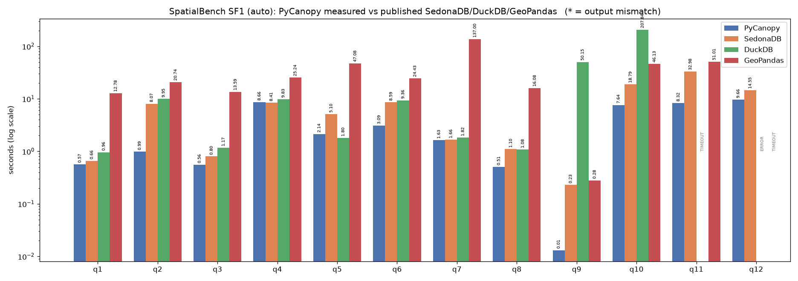
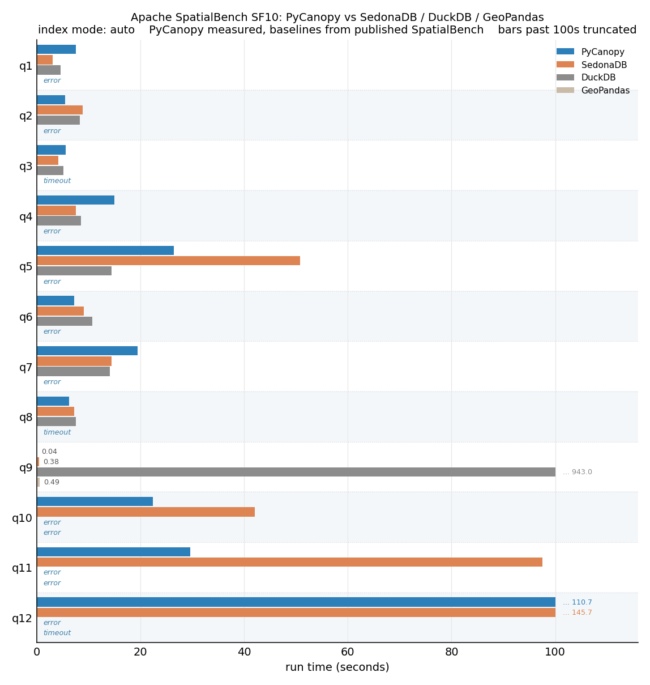
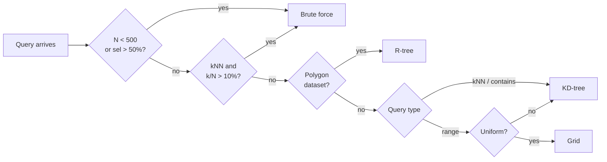

<p align="center">
  
</p>

<p align="center">
  <a href="https://pypi.org/project/pycanopy/"></a>
  <a href="https://pypi.org/project/pycanopy/"></a>
  <a href="https://github.com/pranav-walimbe/pycanopy/actions/workflows/CI.yml"></a>
  <a href="LICENSE"></a>
  <a href="https://pranav-walimbe.github.io/PyCanopy"></a>
  <a href="https://colab.research.google.com/github/pranav-walimbe/PyCanopy/blob/main/assets/PyCanopy_tutorial.ipynb"></a>
</p>

<p align="center">A spatial query layer for Polars. Rust core, Python API.</p>

---

> [!NOTE]
> Highly competitive on [Apache SpatialBench](https://github.com/apache/sedona-spatialbench) (single node spatial query benchmark): fastest on 7/12 queries at SF1 and 5/12 at SF10 despite never leaving Polars-like syntax

<p align="center">
  
</p>
<p align="center"><sub>Apache SpatialBench SF1 · lower is better · bars past the cap truncated with their value · TIMEOUT / ERROR annotated</sub></p>

---

## Installation

```bash
pip install pycanopy
```

> Pre-built wheels for Linux, macOS, and Windows. No Rust toolchain required.

```python
import polars as pl
from pycanopy import SpatialFrame

sf = SpatialFrame(pl.read_parquet("cities.parquet"), x_col="lon", y_col="lat")
result = sf.lazy().filter(pl.col("population") > 100_000).range_query(-10.0, 35.0, 40.0, 70.0).collect()
```

---

## Why PyCanopy

During my undergrad research, I saw firsthad how geospatial dataframe tooling could use improvements. The driving motivator behind creating this library was to provide the optimizations of relational DBs (query planning, indexing, etc) in a fast spatial dataframe interface that abstracts away the complexity of doing so.

Edit (June 2026): Apache Sedona released a cool Python DataFrame API for SedonaDB. There are similarities between their API and this tool but some key differences are (1) this query planner interacts with Polars rather than just being an input source and (2) this uses a cost-model approch to dynamic indexing.

|  | PyCanopy | GeoPandas | DuckDB | SedonaDB | Spatial Polars |
|:--|:--------:|:---------:|:------:|:--------:|:--------------:|
| Polars-native API                               | ✓ | ✗ | ✗ | ✗ | ✓ |
| Spatial query planner (reorder, fuse, pushdown) | ✓ | ✗ | ✓ | ✓ | ✗ |
| Index vs scan decided by cost model             | ✓ | ✗ | ✗ | ✗ | ✗ |
| Dynamic index selection                         | ✓ | ✗ | ✗ | ✗ | ✗ |

---

## Example Operations

### Inspecting the query plan

```python
lf = (
    sf.lazy()
    .range_query(min_x=-10.0, min_y=35.0, max_x=40.0, max_y=70.0)
    .filter(pl.col("population") > 100_000)
)
print(lf.explain())
# RANGE_QUERY [(-10, 35) → (40, 70)]
# FROM
#   FILTER [(col("population")) > (dyn int: 100000)]
#   FROM
#     DF [N=100,000; path: EXPR]
```

The optimizer moved the scalar filter below the range query. It runs first on all rows, then the spatial index is probed on the smaller survivor set.

### kNN join

```python
query_df = pl.DataFrame({"qx": [2.35, 13.4], "qy": [48.85, 52.5]})

result = sf.lazy().knn_join(query_df, x_col="qx", y_col="qy", k=3).collect()
```

For each row in `query_df`, returns the 3 nearest rows in the `SpatialFrame`. Large probes are streamed in morsels automatically.

### Proximity join with aggregation

```python
import pycanopy as pc

stats = (
    sf.lazy()
    .within_distance_join(landmarks, x_col="lon", y_col="lat", distance=0.5)
    .group_by(["landmark"])
    .agg(count=pc.agg.count(), avg_fare=pc.agg.mean("fare"))
)
```

The full pair frame is never materialised. Each probe morsel folds into per-group partials and combines at the end.

### Polygon intersects self-join

```python
from shapely.geometry import box

polygons = [box(i, 0, i + 1.5, 1.0) for i in range(10_000)]
sf = SpatialFrame.from_polygons(pl.DataFrame({"id": range(10_000), "geom": polygons}), geometry_col="geom")

overlaps = sf.intersects_pairs(key_col="id")
```

Returns all intersecting polygon pairs with overlap area and IoU. `key_col` replaces positional indices with values from that column.

> [!NOTE]
> For the full operation catalogue, index modes, streaming joins, and API reference see the **[docs site](https://pranav-walimbe.github.io/PyCanopy)**.

---

## Benchmarks

### Apache SpatialBench

Run on a single `m7i.2xlarge` (8 vCPU, 32 GB), the same hardware used by [Apache SpatialBench](https://github.com/apache/sedona-spatialbench). PyCanopy is measured live with `index_mode="auto"`. Results were produced using the benchmark harness in `bench/spatial_bench`.

**SF1** (~6M trips). PyCanopy wins 7/12 testcases.

<p align="center">
  
</p>
<p align="center"><sub>Apache SpatialBench SF1 · lower is better · linear axis, bars past the cap truncated with their value · TIMEOUT / ERROR annotated</sub></p>

**SF10** (~60M trips). PyCanopy wins 5/12 testcases.

<p align="center">
  
</p>
<p align="center"><sub>Apache SpatialBench SF10 · lower is better · linear axis, bars past the cap truncated with their value · TIMEOUT / ERROR annotated</sub></p>

All times in seconds. **Bold** = fastest on that query. SedonaDB, DuckDB, and GeoPandas baselines from published SpatialBench results.

<table>
<tr>
<td valign="top">

**SF1**

<table>
<tr><th>Query</th><th>PyCanopy</th><th>SedonaDB</th><th>DuckDB</th><th>GeoPandas</th></tr>
<tr><td>q1</td><td>1.41</td><td><b>0.66</b></td><td>0.96</td><td>12.78</td></tr>
<tr><td>q2</td><td><b>3.94</b></td><td>8.07</td><td>9.95</td><td>20.74</td></tr>
<tr><td>q3</td><td>1.22</td><td><b>0.80</b></td><td>1.17</td><td>13.59</td></tr>
<tr><td>q4</td><td>10.88</td><td><b>8.41</b></td><td>9.83</td><td>25.24</td></tr>
<tr><td>q5</td><td><b>1.77</b></td><td>5.10</td><td>1.80</td><td>47.08</td></tr>
<tr><td>q6</td><td><b>5.57</b></td><td>8.59</td><td>9.36</td><td>24.43</td></tr>
<tr><td>q7</td><td>2.22</td><td><b>1.66</b></td><td>1.82</td><td>137.00</td></tr>
<tr><td>q8</td><td><b>1.06</b></td><td>1.10</td><td>1.08</td><td>16.08</td></tr>
<tr><td>q9</td><td><b>0.23</b></td><td>0.23</td><td>50.15</td><td>0.28</td></tr>
<tr><td>q10</td><td><b>11.62</b></td><td>18.79</td><td>207.84</td><td>46.13</td></tr>
<tr><td>q11</td><td><b>12.43</b></td><td>32.98</td><td>TIMEOUT</td><td>51.01</td></tr>
<tr><td>q12</td><td><b>14.00</b></td><td>14.55</td><td>ERROR</td><td>TIMEOUT</td></tr>
</table>

</td>
<td valign="top">

**SF10**

<table>
<tr><th>Query</th><th>PyCanopy</th><th>SedonaDB</th><th>DuckDB</th><th>GeoPandas</th></tr>
<tr><td>q1</td><td>8.59</td><td><b>3.04</b></td><td>4.58</td><td>ERROR</td></tr>
<tr><td>q2</td><td>8.95</td><td>8.89</td><td><b>8.26</b></td><td>ERROR</td></tr>
<tr><td>q3</td><td>7.12</td><td><b>4.09</b></td><td>5.17</td><td>TIMEOUT</td></tr>
<tr><td>q4</td><td>21.34</td><td><b>7.52</b></td><td>8.51</td><td>ERROR</td></tr>
<tr><td>q5</td><td>15.22</td><td>50.81</td><td><b>14.40</b></td><td>ERROR</td></tr>
<tr><td>q6</td><td>11.19</td><td><b>9.11</b></td><td>10.67</td><td>ERROR</td></tr>
<tr><td>q7</td><td>22.73</td><td>14.44</td><td><b>14.03</b></td><td>ERROR</td></tr>
<tr><td>q8</td><td><b>7.03</b></td><td>7.24</td><td>7.57</td><td>TIMEOUT</td></tr>
<tr><td>q9</td><td><b>0.34</b></td><td>0.38</td><td>942.98</td><td>0.49</td></tr>
<tr><td>q10</td><td><b>28.41</b></td><td>42.02</td><td>ERROR</td><td>ERROR</td></tr>
<tr><td>q11</td><td><b>37.30</b></td><td>97.52</td><td>ERROR</td><td>ERROR</td></tr>
<tr><td>q12</td><td>147.67</td><td><b>145.66</b></td><td>ERROR</td><td>TIMEOUT</td></tr>
</table>

</td>
</tr>
</table>

---

## How It Works

The engine has dedicated components for query planning / execution and ultimately returns a Polars DataFrame.

### Query flow


### Logical planning

- **Predicate pushdown:** scalar filters run first, reducing rows before any spatial work.
- **Fusion:** consecutive range/contains predicates merge into a single operation.
- **Join side:** indexes on the side that makes the join most efficient.
- **Projection pushdown:** a terminal `.select()` narrows both join sides before the gather.
- **IO path:** low-selectivity queries return results as a direct slice, bypassing the Polars expression pipeline.
- **EXPR path:** runs the spatial engine as a Polars `map_batches` expression over the query set.

### Cost model

`index_mode` determines how we use the cost model:

| Mode | Behaviour |
|:-----|:----------|
| `auto` (default) | build index when cost model allows it |
| `eager` | always build the selected index type, skip the cost check |
| `none` | always scan |

When `index_mode="auto"`, the planner picks the minimum-cost option ($Q$ queries, $N$ items):

$$
\text{winner} = \arg\min \begin{cases}
\text{Cost}_{\text{probe}}(\text{built index}) & \text{build already paid} \\
\text{Cost}_{\text{build}} + \text{Cost}_{\text{probe}}(\text{best new index}) \\
\text{Cost}_{\text{probe}}(\text{brute force})
\end{cases}
$$

<br>

**Selectivity** (fraction of the dataset expected to match):

$$
\text{sel} = \begin{cases}
\text{hist}(\text{bbox}) / N & \text{range (32×32 density histogram)} \\
k / N & \text{kNN} \\
1 / N & \text{contains}
\end{cases}
$$

<br>

**Probe cost** ($Q$ warm queries against a built index):

$$
\text{Cost}_{\text{probe}} = Q \times \begin{cases}
N \cdot c_{\text{scan}} & \text{brute force} \\
(\log_2 N + \text{sel} \cdot N) \cdot c_{\text{tree}} & \text{KD-tree or R-tree} \\
\text{sel} \cdot N \cdot c_{\text{grid}} & \text{grid}
\end{cases}
$$

<br>

**Build cost** (paid once):

$$
\text{Cost}_{\text{build}} = \begin{cases}
0 & \text{brute force} \\
N \cdot c_{\text{build}} & \text{grid} \\
N \log_2 N \cdot c_{\text{build}} & \text{KD-tree or R-tree}
\end{cases}
$$

The empirical constants ($c_{\text{scan}}$, $c_{\text{tree}}$, $c_{\text{grid}}$, $c_{\text{build}}$) are calibrated from benchmark runs in `bench/ops`.

### Index selection

`select_index` is a rule-based pre-filter that picks a candidate index type:



All index types share the same coordinate arrays with no duplication.

### Why Rust

The hot paths need packed immutable index structures, zero-copy array slices at the Python boundary, and loop-level parallelism. C++ would require a separate FFI layer and would lose the native Polars plugin integration that PyO3/Maturin provides for free.

---

## Acknowledgements

Some works that inspired this project:

- [Polars](https://github.com/pola-rs/polars): a columnar DataFrame engine that PyCanopy builds on
- [geo-index](https://github.com/georust/geo-index): provides packed, immutable, zero-copy KD-tree and R-tree structures used
- [Spatial Polars](https://github.com/ATL2001/spatial_polars): an earlier effort to bring spatial functionality to Polars
- [Apache Sedona](https://sedona.apache.org): state-of-the-art spatial SQL engine + benchmark for evals

---

## License

MIT
