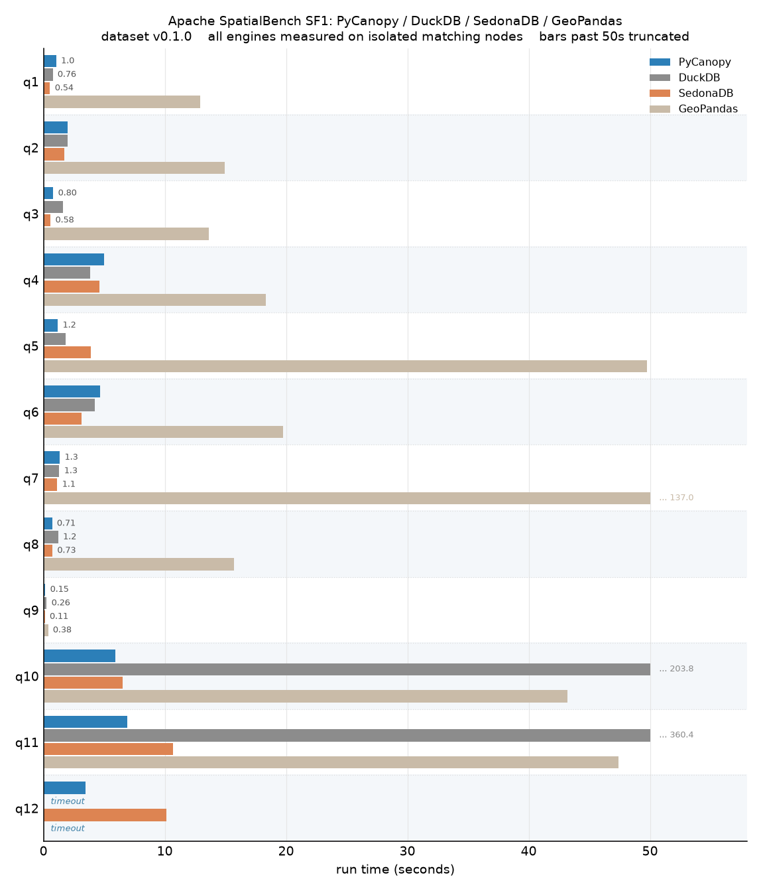
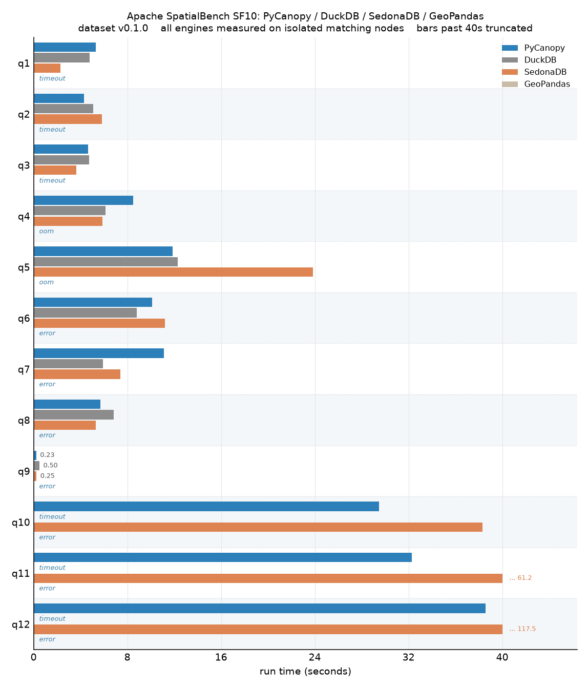

<p align="center">
  
</p>

<p align="center">
  <a href="https://pypi.org/project/pycanopy/"></a>
  <a href="https://pepy.tech/projects/pycanopy"></a>
  <a href="https://pypi.org/project/pycanopy/"></a>
  <a href="https://github.com/pranav-walimbe/pycanopy/actions/workflows/CI.yml"></a>
  <a href="LICENSE"></a>
  <a href="https://pranav-walimbe.github.io/PyCanopy"></a>
  <a href="https://colab.research.google.com/github/pranav-walimbe/PyCanopy/blob/main/assets/PyCanopy_tutorial.ipynb"></a>
</p>

<p align="center">A spatial query layer for Polars. Rust core, Python API.</p>

---

> [!NOTE]
> Fastest on 11/24 testcases in [Apache SpatialBench](#benchmarks) (spatial query benchmark)

---

## Installation

```bash
pip install pycanopy
```

> Pre-built wheels for Linux, macOS, and Windows. No Rust toolchain required.

```python
import polars as pl
from pycanopy import SpatialFrame

sf = SpatialFrame(pl.read_parquet("cities.parquet"), x_col="lon", y_col="lat")
result = sf.lazy().filter(pl.col("population") > 100_000).range_query(-10.0, 35.0, 40.0, 70.0).collect()
```

---

## Why PyCanopy

The driving motivator behind creating this library was to provide the optimizations of relational DBs (query planning, indexing, etc) in a fast, Polars-like interface meant for in-memory spatial work.

| Capability | PyCanopy | GeoPandas | DuckDB | SedonaDB | Spatial Polars |
|:--|:--:|:--:|:--:|:--:|:--:|
| Uses Polars DataFrames directly | ✓ | ✗ | ✗ | ✗ | ✓ |
| Spatial-aware query planning | ✓ | ✗ | ✓ | ✓ | ✗ |
| Automatically accelerates spatial joins with an index | ✓ | ✓ | ✓ | ✓ | ✗ |
| Explicit cost-based choice between scanning and building an index | ✓ | ✗ | ✗ | ✗ | ✗ |
| Selects among multiple spatial index types by workload | ✓ | ✗ | ✗ | ✗ | ✗ |

---

## Example Operations

### Optimized range query

```python
lf = (
    sf.lazy()
    .range_query(min_x=-10.0, min_y=35.0, max_x=40.0, max_y=70.0)
    .filter(pl.col("population") > 100_000)
)
print(lf.explain())
# RANGE_QUERY [(-10, 35) → (40, 70)]
# FROM
#   FILTER [(col("population")) > (dyn int: 100000)]
#   FROM
#     DF [N=100,000; path: EXPR]
```

The optimizer runs the scalar filter first. On the EXPR path, the surviving original row indices are passed to Rust, which returns a spatial Boolean mask over those candidates.

### kNN join

```python
query_df = pl.DataFrame({"qx": [2.35, 13.4], "qy": [48.85, 52.5]})

result = sf.lazy().knn_join(query_df, x_col="qx", y_col="qy", k=3).collect()
```

For each row in `query_df`, returns the 3 nearest rows in the `SpatialFrame`. Large probes are streamed in morsels automatically.

### Point-in-polygon join with aggregation

```python
import pycanopy as pc

zones = SpatialFrame.from_wkb_polygons(
    pl.read_parquet("zones.parquet"),
    geometry_col="geometry",
)
trips = pl.read_parquet("trips.parquet")

stats = (
    zones.lazy()
    .within_join(trips, x_col="lon", y_col="lat")
    .group_by(["zone_id"])
    .agg(trip_count=pc.agg.count(), avg_fare=pc.agg.mean("fare"))
)
```

Each query-side batch is joined and aggregated before the next begins, so the complete pair frame is never materialized.

> [!NOTE]
> For the full operation catalog, index modes, streaming joins, and API reference see the **[docs site](https://pranav-walimbe.github.io/PyCanopy)**.

---

## Benchmarks

### Apache SpatialBench

Run on a single `m7i.2xlarge` (8 vCPU, 32 GB), the same hardware used by [Apache SpatialBench](https://github.com/apache/sedona-spatialbench). PyCanopy is measured live with `index_mode="auto"`. Results were produced using the benchmark harness in `bench/spatial_bench`.

PyCanopy is fastest on 11/24 testcases (there is some variance among benchmark runs).

**SF1** (~6M trips)

<p align="center">
  
</p>
<p align="center"><sub>Apache SpatialBench SF1 · lower is better · linear axis, bars past the cap truncated with their value · TIMEOUT / ERROR annotated</sub></p>

**SF10** (~60M trips)

<p align="center">
  
</p>
<p align="center"><sub>Apache SpatialBench SF10 · lower is better · linear axis, bars past the cap truncated with their value · TIMEOUT / ERROR annotated</sub></p>

All engines were measured by the PyCanopy benchmark harness against the pinned SpatialBench workload. See the [full per-query results and methodology](https://pranav-walimbe.github.io/PyCanopy/benchmarks/).

---

## High Level Overview

### Spatial Query Planning

- Mixes Polars filters and projections with range, containment, distance, k-nearest-neighbour, and join operations
- Pushes down compatible predicates and projections and fuses spatial filters
- Uses cost-based planning to choose the execution order of supported spatial joins

### Automatic Indexing

- Uses a cost model to choose between a parallel scan, an existing index, or building a new index
- Selects grid, KD-tree, or R-tree indexes based on the geometry and workload

### Performant Execution

- Processes large joins in morsels and reduces supported grouped aggregations without materializing the complete pair frame
- Runs compute-intensive spatial kernels in parallel Rust outside the Python GIL
- Stores geometry in contiguous arrays and KD-tree and R-tree indexes in packed immutable buffers for cache-efficient traversal

For a detailed overview of PyCanopy's design, see the [How It Works documentation](https://pranav-walimbe.github.io/PyCanopy/how-it-works/architecture/).

---

## Acknowledgements

Some works that inspired this project:

- [Polars](https://github.com/pola-rs/polars): a columnar DataFrame engine that PyCanopy builds on
- [geo-index](https://github.com/georust/geo-index): provides packed, immutable, zero-copy KD-tree and R-tree structures used
- [Spatial Polars](https://github.com/ATL2001/spatial_polars): an earlier effort to bring spatial functionality to Polars
- [Apache Sedona](https://sedona.apache.org): state-of-the-art spatial SQL engine + benchmark for evals

---

## License

MIT
