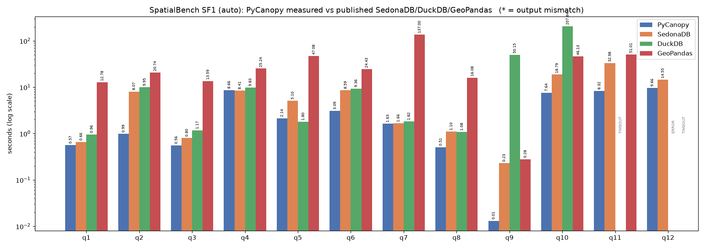
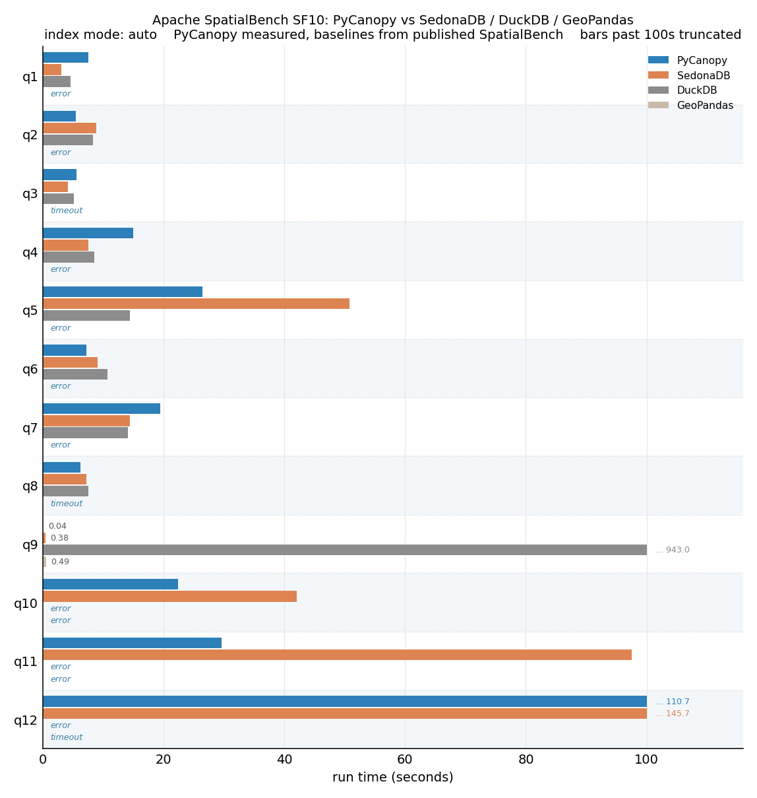
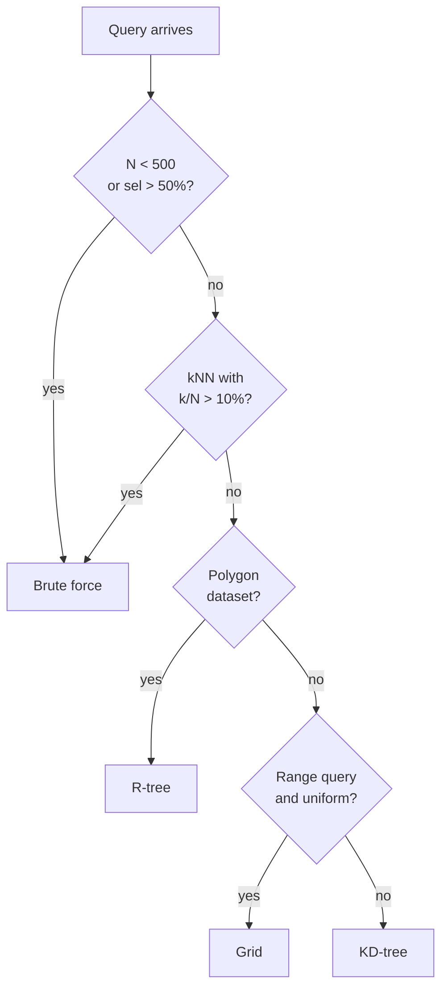

<p align="center">
  
</p>

<p align="center">
  <a href="https://pypi.org/project/pycanopy/"></a>
  <a href="https://pypi.org/project/pycanopy/"></a>
  <a href="https://github.com/pranav-walimbe/pycanopy/actions/workflows/CI.yml"></a>
  <a href="LICENSE"></a>
  <a href="https://pranav-walimbe.github.io/PyCanopy"></a>
  <a href="https://colab.research.google.com/github/pranav-walimbe/PyCanopy/blob/main/assets/PyCanopy_tutorial.ipynb"></a>
</p>

<p align="center">A spatial query layer for Polars. Rust core, Python API.</p>

---

> [!NOTE]
> Highly competitive on [Apache SpatialBench](https://github.com/apache/sedona-spatialbench) (single-node spatial query benchmark): fastest on 11/24 testcases including one tie, within 5% of the fastest time on 14/24 testcases

<p align="center">
  
</p>
<p align="center"><sub>Apache SpatialBench SF1 · lower is better · bars past the cap truncated with their value · TIMEOUT / ERROR annotated</sub></p>

---

## Installation

```bash
pip install pycanopy
```

> Pre-built wheels for Linux, macOS, and Windows. No Rust toolchain required.

```python
import polars as pl
from pycanopy import SpatialFrame

sf = SpatialFrame(pl.read_parquet("cities.parquet"), x_col="lon", y_col="lat")
result = sf.lazy().filter(pl.col("population") > 100_000).range_query(-10.0, 35.0, 40.0, 70.0).collect()
```

---

## Why PyCanopy

The driving motivator behind creating this library was to provide the optimizations of relational DBs (query planning, indexing, etc) in a fast, Polars-like interface meant for in-memory spatial work.

| Capability | PyCanopy | GeoPandas | DuckDB | SedonaDB | Spatial Polars |
|:--|:--:|:--:|:--:|:--:|:--:|
| Uses Polars DataFrames directly | ✓ | ✗ | ✗ | ✗ | ✓ |
| Spatial-aware query planning | ✓ | ✗ | ✓ | ✓ | ✗ |
| Automatically accelerates spatial joins with an index | ✓ | ✓ | ✓ | ✓ | ✗ |
| Explicit cost-based choice between scanning and building an index | ✓ | ✗ | ✗ | ✗ | ✗ |
| Selects among multiple spatial index types by workload | ✓ | ✗ | ✗ | ✗ | ✗ |

---

## Example Operations

### Inspecting the query plan

```python
lf = (
    sf.lazy()
    .range_query(min_x=-10.0, min_y=35.0, max_x=40.0, max_y=70.0)
    .filter(pl.col("population") > 100_000)
)
print(lf.explain())
# RANGE_QUERY [(-10, 35) → (40, 70)]
# FROM
#   FILTER [(col("population")) > (dyn int: 100000)]
#   FROM
#     DF [N=100,000; path: EXPR]
```

The optimizer runs the scalar filter first. On the EXPR path, the surviving original row indices are passed to Rust, which returns a spatial Boolean mask over those candidates.

### kNN join

```python
query_df = pl.DataFrame({"qx": [2.35, 13.4], "qy": [48.85, 52.5]})

result = sf.lazy().knn_join(query_df, x_col="qx", y_col="qy", k=3).collect()
```

For each row in `query_df`, returns the 3 nearest rows in the `SpatialFrame`. Large probes are streamed in morsels automatically.

### Proximity join with aggregation

```python
import pycanopy as pc

stats = (
    sf.lazy()
    .within_distance_join(landmarks, x_col="lon", y_col="lat", distance=0.5)
    .group_by(["landmark"])
    .agg(count=pc.agg.count(), avg_fare=pc.agg.mean("fare"))
)
```

The full pair frame is never materialized. Each probe morsel folds into per-group partials and combines at the end.

### Polygon intersects self-join

```python
from shapely.geometry import box

polygons = [box(i, 0, i + 1.5, 1.0) for i in range(10_000)]
sf = SpatialFrame.from_polygons(pl.DataFrame({"id": range(10_000), "geom": polygons}), geometry_col="geom")

overlaps = sf.intersects_pairs(key_col="id")
```

Returns all intersecting polygon pairs with overlap area and IoU. `key_col` replaces positional indices with values from that column.

> [!NOTE]
> For the full operation catalog, index modes, streaming joins, and API reference see the **[docs site](https://pranav-walimbe.github.io/PyCanopy)**.

---

## Benchmarks

### Apache SpatialBench

Run on a single `m7i.2xlarge` (8 vCPU, 32 GB), the same hardware used by [Apache SpatialBench](https://github.com/apache/sedona-spatialbench). PyCanopy is measured live with `index_mode="auto"`. Results were produced using the benchmark harness in `bench/spatial_bench`.

PyCanopy is fastest on 11/24 testcases, including one tie, and lands within 5% of the fastest time on 14/24 testcases (there is some variance among benchmark runs).

**SF1** (~6M trips)

<p align="center">
  
</p>
<p align="center"><sub>Apache SpatialBench SF1 · lower is better · linear axis, bars past the cap truncated with their value · TIMEOUT / ERROR annotated</sub></p>

**SF10** (~60M trips)

<p align="center">
  
</p>
<p align="center"><sub>Apache SpatialBench SF10 · lower is better · linear axis, bars past the cap truncated with their value · TIMEOUT / ERROR annotated</sub></p>

SedonaDB, DuckDB, and GeoPandas baselines come from published SpatialBench results. See the [full per-query results and methodology](https://pranav-walimbe.github.io/PyCanopy/benchmarks/).

---

## How It Works

The engine has dedicated components for query planning / execution and ultimately returns a Polars DataFrame.

### Query flow


```mermaid
flowchart LR
    A[User chain] --> B[SpatialOptimizer] --> C[SpatialExecutor] --> F[pl.DataFrame]
```

### Logical planning

- **Predicate pushdown:** scalar filters run first, reducing rows before any spatial work.
- **Fusion:** eligible consecutive range and contains predicates are combined into a single Rust call.
- **Join side:** within and within-distance joins may be flipped based on the relative input sizes.
- **Projection pushdown:** a terminal `.select()` narrows both join sides before the gather.
- **IO path:** low-selectivity queries return results as a direct slice, bypassing the Polars expression pipeline.
- **EXPR path:** runs the spatial engine as a Polars `map_batches` expression over the query set.

### Cost model

`index_mode` determines how we use the cost model:

| Mode | Behavior |
|:-----|:----------|
| `auto` (default) | build index when cost model allows it |
| `eager` | always build the selected index type, skip the cost check |
| `none` | always scan |

When `index_mode="auto"`, the planner picks the minimum-cost option ($Q$ queries, $N$ items):

$$
\text{winner} = \arg\min \begin{cases}
\text{Cost}_{\text{probe}}(\text{built index}) & \text{build already paid} \\
\text{Cost}_{\text{build}} + \text{Cost}_{\text{probe}}(\text{best new index}) \\
\text{Cost}_{\text{probe}}(\text{brute force})
\end{cases}
$$

<br>

**Selectivity** (fraction of the dataset expected to match):

$$
\text{sel} = \begin{cases}
\text{hist}(\text{bbox}) / N & \text{range (32×32 density histogram)} \\
k / N & \text{kNN} \\
1 / N & \text{contains}
\end{cases}
$$

<br>

**Probe cost** ($Q$ warm queries against a built index):

$$
\text{Cost}_{\text{probe}} = Q \times \begin{cases}
N \cdot c_{\text{scan}} & \text{brute force} \\
(\log_2 N + \text{sel} \cdot N) \cdot c_{\text{tree}} & \text{KD-tree or R-tree} \\
\text{sel} \cdot N \cdot c_{\text{grid}} & \text{grid}
\end{cases}
$$

<br>

**Build cost** (paid once):

$$
\text{Cost}_{\text{build}} = \begin{cases}
0 & \text{brute force} \\
N \cdot c_{\text{build}} & \text{grid} \\
N \log_2 N \cdot c_{\text{build}} & \text{KD-tree or R-tree}
\end{cases}
$$

The empirical constants ($c_{\text{scan}}$, $c_{\text{tree}}$, $c_{\text{grid}}$, $c_{\text{build}}$) are calibrated from benchmark runs in `bench/ops`.

### Index selection

`select_index` is a rule-based pre-filter that picks a candidate index type:


```mermaid
flowchart TD
    A[Query arrives] --> B{N < 500\nor sel > 50%?}
    B -- yes --> BF[Brute force]
    B -- no --> C{kNN with\nk/N > 10%?}
    C -- yes --> BF
    C -- no --> D{Polygon\ndataset?}
    D -- yes --> RT[R-tree]
    D -- no --> E{Range query\nand uniform?}
    E -- yes --> GR[Grid]
    E -- no --> KD[KD-tree]
```

Index implementations reuse the engine's coordinate buffers where applicable. KD-tree, grid, and point brute-force indexes share the same reference-counted arrays rather than copying coordinate data.

### Why Rust

The hot paths benefit from packed immutable index structures, parallel loops, and efficient access to contiguous NumPy buffers. PyO3 and Maturin provide direct Python bindings and cross-platform extension packaging.

---

## Acknowledgements

Some works that inspired this project:

- [Polars](https://github.com/pola-rs/polars): a columnar DataFrame engine that PyCanopy builds on
- [geo-index](https://github.com/georust/geo-index): provides packed, immutable, zero-copy KD-tree and R-tree structures used
- [Spatial Polars](https://github.com/ATL2001/spatial_polars): an earlier effort to bring spatial functionality to Polars
- [Apache Sedona](https://sedona.apache.org): state-of-the-art spatial SQL engine + benchmark for evals

---

## License

MIT
