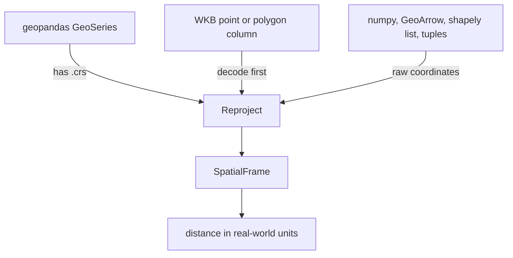

# Distance Operations

Every distance operation (`within_distance_join`, `within_distance_of_point`, `polygon_within_distance_join`, `points_within_distance_of_polygon`, kNN distance columns) computes Euclidean distance directly on `x_col`/`y_col` (`distance` means in whatever units your coordinates are in).

## Best practice

Project to a planar CRS (meters) before building the `SpatialFrame` if `distance` needs to mean meters or kilometers. This is a one-time step done outside PyCanopy. Either `geopandas` or `pyproj` can do the reprojection:

```python
import geopandas as gpd
import polars as pl
from pycanopy import SpatialFrame

df = pl.read_parquet("large_dataset.parquet")  # has 'lon', 'lat' columns
gdf = gpd.GeoDataFrame(df.to_pandas(), geometry=gpd.points_from_xy(df["lon"], df["lat"]), crs="EPSG:4326")
gdf_m = gdf.to_crs(gdf.estimate_utm_crs())  # auto-picks a local UTM zone

df_m = df.with_columns(pl.Series("x_m", gdf_m.geometry.x.to_numpy()), pl.Series("y_m", gdf_m.geometry.y.to_numpy()))
sf = SpatialFrame(df_m, x_col="x_m", y_col="y_m")

result = sf.lazy().within_distance_of_point(cx=cx_m, cy=cy_m, distance=500_000).collect()  # 500 km
```

`pyproj` does the same reprojection directly on numpy arrays, useful if you'd rather not bring in `geopandas`.

For a join (`within_distance_join`, `polygon_within_distance_join`), reproject both sides into the same target CRS.

## Recommendation by input type


