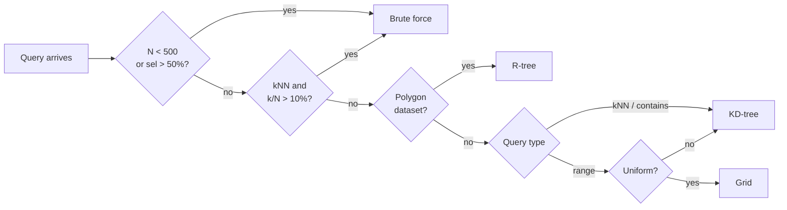

# How It Works

## Query flow

## Logical planning

- **Predicate pushdown:** scalar filters run first, reducing rows before any spatial work.
- **Fusion:** consecutive range/contains predicates merge into a single operation.
- **Join side:** indexes on the side that makes the join most efficient.
- **Projection pushdown:** a terminal `.select()` narrows both join sides before the gather.
- **IO path:** low-selectivity queries return results as a direct slice, bypassing the Polars expression pipeline.
- **EXPR path:** runs the spatial engine as a Polars `map_batches` expression over the query set.

## Cost model

`index_mode` determines how the cost model is applied:

| Mode | Behaviour |
|:-----|:----------|
| `auto` (default) | build index when cost model allows it |
| `eager` | always build the selected index type, skip the cost check |
| `none` | always scan |

When `index_mode="auto"`, the planner picks the minimum-cost option ($Q$ queries, $N$ items):

$$
\text{winner} = \arg\min \begin{cases}
\text{Cost}_{\text{probe}}(\text{built index}) & \text{build already paid} \\
\text{Cost}_{\text{build}} + \text{Cost}_{\text{probe}}(\text{best new index}) \\
\text{Cost}_{\text{probe}}(\text{brute force})
\end{cases}
$$

**Selectivity** (fraction of the dataset expected to match):

$$
\text{sel} = \begin{cases}
\text{hist}(\text{bbox}) / N & \text{range (32×32 density histogram)} \\
k / N & \text{kNN} \\
1 / N & \text{contains}
\end{cases}
$$

**Probe cost** ($Q$ warm queries against a built index):

$$
\text{Cost}_{\text{probe}} = Q \times \begin{cases}
N \cdot c_{\text{scan}} & \text{brute force} \\
(\log_2 N + \text{sel} \cdot N) \cdot c_{\text{tree}} & \text{KD-tree or R-tree} \\
\text{sel} \cdot N \cdot c_{\text{grid}} & \text{grid}
\end{cases}
$$

**Build cost** (paid once):

$$
\text{Cost}_{\text{build}} = \begin{cases}
0 & \text{brute force} \\
N \cdot c_{\text{build}} & \text{grid} \\
N \log_2 N \cdot c_{\text{build}} & \text{KD-tree or R-tree}
\end{cases}
$$

The empirical constants ($c_{\text{scan}}$, $c_{\text{tree}}$, $c_{\text{grid}}$, $c_{\text{build}}$) are calibrated from benchmark runs in `bench/ops`.

## Index selection

`select_index` is a rule-based pre-filter that picks a candidate index type before the cost gate:

All index types share the same coordinate arrays with no duplication.

## Why Rust

The hot paths need packed immutable index structures, zero-copy array slices at the Python boundary, and loop-level parallelism. C++ would require a separate FFI layer and would lose the native Polars plugin integration that PyO3/Maturin provides for free.
