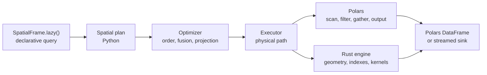

# Architecture Overview

PyCanopy is a spatial query layer around Polars rather than a replacement DataFrame engine.



## Design boundaries

- **Polars owns tabular work:** file scans, scalar expressions, column projection, row gathering,
  joins by key, sorting, and final output
- **Rust owns spatial work:** native geometry, dataset statistics, spatial indexes, candidate
  traversal, exact geometry predicates, and parallel kernels
- **Python connects the two:** immutable plan nodes, optimization passes, execution routing, and
  morsel orchestration
- **Spatial indexes are optional:** the engine can scan, reuse an index, or build one for the
  current workload

## One query through the system

```python
result = (
    zones.lazy()
    .within_join(trips, x_col="lon", y_col="lat")
    .filter(pl.col("fare") > 20)
    .select("trip_id", "zone_id")
    .collect()
)
```

```mermaid
sequenceDiagram
    participant User
    participant Plan as SpatialLazyFrame
    participant Opt as Optimizer
    participant Rust as Rust engine
    participant Polars

    User->>Plan: declare join, filter, projection
    User->>Plan: collect()
    Plan->>Opt: immutable plan
    Opt->>Opt: preserve join barrier and push projection
    Opt->>Rust: execute point-in-polygon join
    Rust-->>Polars: query and target row indices
    Polars->>Polars: gather narrow columns and apply fare filter
    Polars-->>User: result DataFrame
```

## Design philosophy

- Keep user data in Polars instead of introducing a second table abstraction
- Cross the Python/Rust boundary with contiguous arrays and compact row indices
- Build an index only when its expected reuse or probe savings repay its build cost
- Bound large join intermediates without claiming every query is out of core
- Keep query-specific planning in the library rather than requiring handwritten execution plans

The following pages trace each layer in more detail, from source ingestion through result
materialization.
