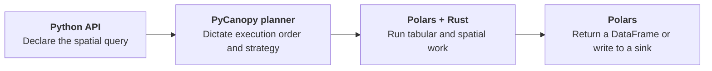
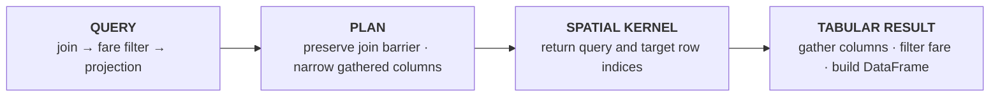

# Architecture Overview

PyCanopy is a spatial query layer around Polars rather than a replacement DataFrame engine.



## How Things Fit Together

- **Polars owns tabular work:** file scans, scalar expressions, column projection, row gathering,
  joins by key, sorting, and final output
- **Rust owns spatial work:** native geometry, dataset statistics, spatial indexes, candidate
  traversal, exact geometry predicates, and parallel kernels
- **Python connects the two:** immutable plan nodes, optimization passes, execution routing, and
  morsel orchestration

## One query through the system

```python
result = (
    zones.lazy()
    .within_join(trips, x_col="lon", y_col="lat")
    .filter(pl.col("fare") > 20)
    .select("trip_id", "zone_id")
    .collect()
)
```



The following pages trace each layer in more detail, from source ingestion through result
materialization.
