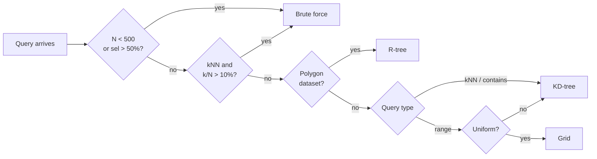

# Cost Model & Index Selection

## Index types

PyCanopy maintains four index implementations that share the same underlying coordinate arrays:

| Index | Best for |
|:------|:---------|
| KD-tree | Point kNN, point containment queries |
| R-tree | Polygon datasets, MBR range queries |
| Grid | Range queries on uniformly distributed points |
| Brute force | Small datasets (N < 500) or high-selectivity queries |

## Index mode

`index_mode` is set once at `SpatialFrame` construction and controls how the cost model is applied:

| Mode | Behaviour |
|:-----|:----------|
| `auto` (default) | Build index only when the cost model says it beats a scan |
| `eager` | Always build the selected index type, skip the cost check |
| `none` | Always scan brute-force |

## Rule-based pre-filter

Before the cost gate, `select_index` applies a rule-based pre-filter to pick a candidate index type:



Uniformity is assessed from the 32×32 density histogram built over the coordinate extents.

## Cost gate

When `index_mode="auto"`, the planner computes three costs and picks the minimum ($Q$ = probe count, $N$ = dataset size):

$$
\text{winner} = \arg\min \begin{cases}
\text{Cost}_{\text{probe}}(\text{built index}) & \text{build already paid} \\
\text{Cost}_{\text{build}} + \text{Cost}_{\text{probe}}(\text{best new index}) \\
\text{Cost}_{\text{probe}}(\text{brute force})
\end{cases}
$$

**Selectivity** (fraction of $N$ expected to match):

$$
\text{sel} = \begin{cases}
\text{hist}(\text{bbox}) / N & \text{range query (32×32 histogram)} \\
k / N & \text{kNN} \\
1 / N & \text{contains}
\end{cases}
$$

**Probe cost** ($Q$ warm queries against a built index):

$$
\text{Cost}_{\text{probe}} = Q \times \begin{cases}
N \cdot c_{\text{scan}} & \text{brute force} \\
(\log_2 N + \text{sel} \cdot N) \cdot c_{\text{tree}} & \text{KD-tree or R-tree} \\
\text{sel} \cdot N \cdot c_{\text{grid}} & \text{grid}
\end{cases}
$$

**Build cost** (paid once, amortised over $Q$ queries):

$$
\text{Cost}_{\text{build}} = \begin{cases}
0 & \text{brute force} \\
N \cdot c_{\text{build}} & \text{grid} \\
N \log_2 N \cdot c_{\text{build}} & \text{KD-tree or R-tree}
\end{cases}
$$

## Calibration

The empirical constants ($c_{\text{scan}}$, $c_{\text{tree}}$, $c_{\text{grid}}$, $c_{\text{build}}$) live in `src/planner/calibration.rs` and are derived by running the ops benchmark suite:

```bash
python -m bench.ops --sizes 10000 100000 1000000 --queries 100
```

This sweeps probe time per (index kind, query kind) across dataset sizes and fits the constants. Re-run after `maturin develop --release` on any new hardware.
