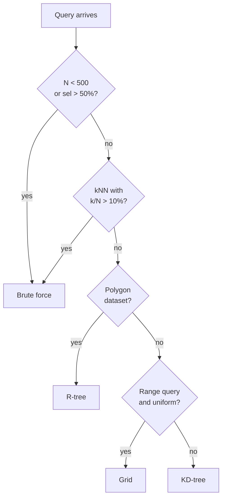

# Cost Model & Index Selection

## Index types

PyCanopy provides four spatial access implementations. KD-tree, grid, and point brute-force indexes share the engine's coordinate buffers, while the R-tree builds a separate packed bounding-box representation for polygon and MBR queries.

| Index | Best for |
|:------|:---------|
| KD-tree | Point kNN, point containment queries |
| R-tree | Polygon datasets, MBR range queries |
| Grid | Range queries on uniformly distributed points |
| Brute force | Small datasets (N < 500) or high-selectivity queries |

## Index mode

`index_mode` is configured when a `SpatialFrame` is constructed and controls how spatial indexes are used. Advanced users can change the mode later through `sf.engine.set_index_mode(...)`.

| Mode | Behavior |
|:-----|:----------|
| `auto` (default) | Build index only when the cost model says it beats a scan |
| `eager` | Always build the selected index type, skip the cost check |
| `none` | Always scan brute-force |

## Rule-based pre-filter

Before the cost gate, `select_index` applies a rule-based pre-filter to pick a candidate index type:


```mermaid
flowchart TD
    A[Query arrives] --> B{N < 500\nor sel > 50%?}
    B -- yes --> BF[Brute force]
    B -- no --> C{kNN with\nk/N > 10%?}
    C -- yes --> BF
    C -- no --> D{Polygon\ndataset?}
    D -- yes --> RT[R-tree]
    D -- no --> E{Range query\nand uniform?}
    E -- yes --> GR[Grid]
    E -- no --> KD[KD-tree]
```

Point-distribution uniformity is classified separately from selectivity estimation. The engine divides the coordinate extent into a grid, measures the coefficient of variation of cell counts, and classifies distributions above the configured threshold as clustered. The fixed 32×32 density histogram is used to estimate range-query selectivity.

## Cost gate

When `index_mode="auto"`, the planner computes three costs and picks the minimum ($Q$ = probe count, $N$ = dataset size):

$$
\text{winner} = \arg\min \begin{cases}
\text{Cost}_{\text{probe}}(\text{built index}) & \text{build already paid} \\
\text{Cost}_{\text{build}} + \text{Cost}_{\text{probe}}(\text{best new index}) \\
\text{Cost}_{\text{probe}}(\text{brute force})
\end{cases}
$$

**Selectivity** (fraction of $N$ expected to match):

$$
\text{sel} = \begin{cases}
\text{hist}(\text{bbox}) / N & \text{range query (32×32 histogram)} \\
k / N & \text{kNN} \\
1 / N & \text{contains}
\end{cases}
$$

**Probe cost** ($Q$ warm queries against a built index):

$$
\text{Cost}_{\text{probe}} = Q \times \begin{cases}
N \cdot c_{\text{scan}} & \text{brute force} \\
(\log_2 N + \text{sel} \cdot N) \cdot c_{\text{tree}} & \text{KD-tree or R-tree} \\
\text{sel} \cdot N \cdot c_{\text{grid}} & \text{grid}
\end{cases}
$$

**Build cost** (paid once, amortized over $Q$ queries):

$$
\text{Cost}_{\text{build}} = \begin{cases}
0 & \text{brute force} \\
N \cdot c_{\text{build}} & \text{grid} \\
N \log_2 N \cdot c_{\text{build}} & \text{KD-tree or R-tree}
\end{cases}
$$

## Calibration

The empirical constants ($c_{\text{scan}}$, $c_{\text{tree}}$, $c_{\text{grid}}$, $c_{\text{build}}$) live in `src/planner/calibration.rs` and are derived by running the ops benchmark suite:

```bash
uv run python -m bench.ops

# Optional timing repetitions and random seed
uv run python -m bench.ops --runs 5 --seed 42
```

The suite runs fixed sweeps across point and polygon dataset sizes. For each measurement, it divides elapsed time by the corresponding workload term and takes the median normalized ratio across sizes. Run it against a release build when recalibrating the constants for target hardware.
