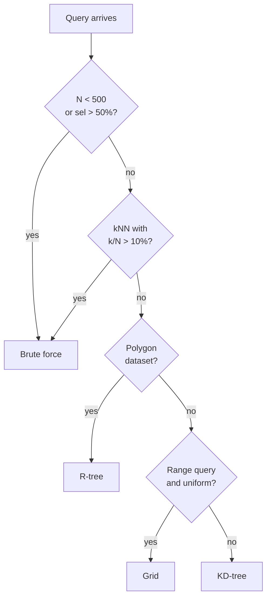

# Cost Model & Index Selection

## Index types

PyCanopy chooses among four spatial access paths:

| Index | Best for |
|:------|:---------|
| KD-tree | Point kNN and range queries over clustered point data |
| R-tree | Polygon queries and bounding-box searches |
| Grid | Range and distance queries over uniformly distributed points |
| Brute force | Small datasets or queries expected to scan or return much of the dataset |

## Index mode

`index_mode` is set on `SpatialFrame` construction and can later be changed through
`sf.engine.set_index_mode(...)`.

| Mode | Behavior |
|:-----|:----------|
| `auto` (default) | Build index only when the cost model says it beats a scan |
| `eager` | Use the rule-selected access path without comparing its estimated cost with a scan |
| `none` | Always scan brute-force |

## Candidate index selection

When the engine considers building a new index, `select_index` applies these rules to pick
the candidate type:


```mermaid
flowchart TD
    A[Query arrives] --> B{N < 500\nor sel > 50%?}
    B -- yes --> BF[Brute force]
    B -- no --> C{kNN with\nk/N > 10%?}
    C -- yes --> BF
    C -- no --> D{Polygon\ndataset?}
    D -- yes --> RT[R-tree]
    D -- no --> E{Range query\nand uniform?}
    E -- yes --> GR[Grid]
    E -- no --> KD[KD-tree]
```

Point distribution is classified from variation in grid-cell counts. A separate 32×32
histogram estimates range selectivity; polygon histograms count exterior-ring centroids.

In `auto` mode, cached indexes are also candidates and their build cost is already paid.

## Cost gate

When `index_mode="auto"`, the planner compares the applicable costs and picks the minimum
($Q$ = probe count, $N$ = dataset size):

$$
\text{winner} = \arg\min \begin{cases}
\text{Cost}_{\text{probe}}(\text{each built index}) & \text{build already paid} \\
\text{Cost}_{\text{build}} + \text{Cost}_{\text{probe}}(\text{best new index}) \\
\text{Cost}_{\text{probe}}(\text{brute force})
\end{cases}
$$

**Selectivity** (fraction of $N$ expected to match):

$$
\text{sel} = \begin{cases}
\text{hist}(\text{bbox}) / N & \text{range query (32×32 histogram)} \\
k / N & \text{kNN} \\
1 / N & \text{contains}
\end{cases}
$$

**Probe cost** ($Q$ warm queries against a built index):

$$
\text{Cost}_{\text{probe}} = Q \times \begin{cases}
N \cdot c_{\text{scan}} & \text{brute force} \\
(\log_2 N + \text{sel} \cdot N) \cdot c_{\text{tree}} & \text{KD-tree or R-tree} \\
\text{sel} \cdot N \cdot c_{\text{grid}} & \text{grid}
\end{cases}
$$

**Build cost** (paid once and compared with the probe cost for all $Q$ queries):

$$
\text{Cost}_{\text{build}} = \begin{cases}
0 & \text{brute force} \\
N \cdot c_{\text{build}} & \text{grid} \\
N \log_2 N \cdot c_{\text{build}} & \text{KD-tree or R-tree}
\end{cases}
$$

## Calibration

The formulas above use generic names for readability. The operation-specific constants in
`src/planner/calibration.rs` can be recalibrated with:

```bash
uv run python -m bench.ops

# Optional timing repetitions and random seed
uv run python -m bench.ops --runs 5 --seed 42
```

The suite normalizes timings across point and polygon dataset sizes and reports the median
ratio. Use a release build when calibrating for target hardware.
