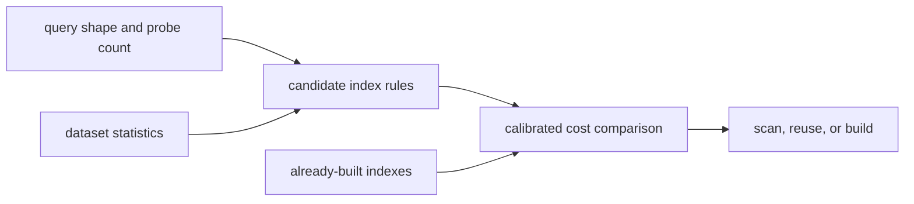
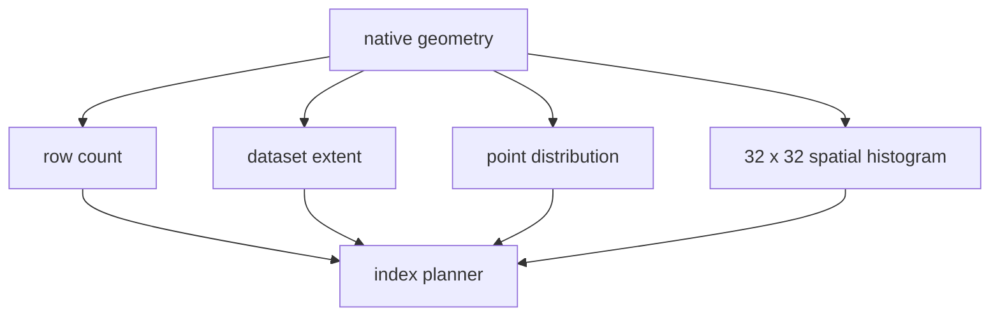
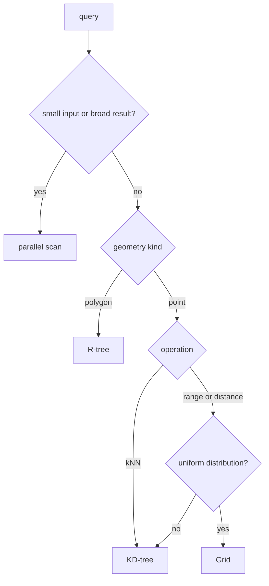
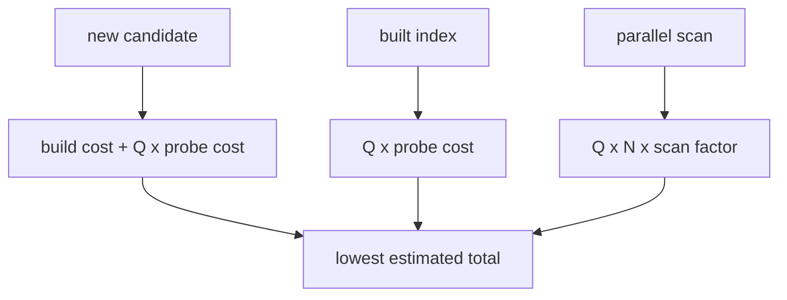

# Cost Model and Automatic Indexing

Automatic indexing answers two separate questions:

1. Which access structure fits this geometry and query?
2. Is building it cheaper than scanning or reusing an existing index?


```mermaid
flowchart LR
    Q["query shape and probe count"] --> CAND["candidate index rules"]
    ST["dataset statistics"] --> CAND
    CAND --> COST["calibrated cost comparison"]
    BUILT["already-built indexes"] --> COST
    COST --> WIN["scan, reuse, or build"]
```

## Access paths

| Access path | Typical role |
|:------------|:-------------|
| Parallel scan | Small inputs, broad queries, or index builds that cannot repay their cost |
| Grid | Range and distance workloads over uniform point data |
| KD-tree | Point kNN and non-uniform point range workloads |
| R-tree | Polygon bounds, polygon queries, and polygon kNN candidates |

These are candidates rather than promises. In `auto` mode, a query can still choose a scan even
when an index type fits its shape.

## Statistics collected once


```mermaid
flowchart TB
    GEO["native geometry"] --> N["row count"]
    GEO --> EXT["dataset extent"]
    GEO --> DIST["point distribution"]
    GEO --> HIST["32 x 32 spatial histogram"]
    N --> PLAN["index planner"]
    EXT --> PLAN
    DIST --> PLAN
    HIST --> PLAN
```

- Row count gates index work on small datasets
- Extent provides a fallback area-based selectivity estimate
- Grid-cell variation classifies point data as uniform or clustered
- The histogram estimates range-query output more accurately than extent area alone
- Polygon histograms bin each polygon by its exterior-ring centroid

## Candidate selection


```mermaid
flowchart TD
    A["query"] --> SMALL{"small input or broad result?"}
    SMALL -- yes --> SCAN["parallel scan"]
    SMALL -- no --> KIND{"geometry kind"}
    KIND -- polygon --> RT["R-tree"]
    KIND -- point --> OP{"operation"}
    OP -- kNN --> KD["KD-tree"]
    OP -- range or distance --> DIST{"uniform distribution?"}
    DIST -- yes --> GRID["Grid"]
    DIST -- no --> KD
```

The exact gates are implementation details. The important boundary is that rule-based candidate
selection happens before the calibrated scan/build/reuse comparison.

## Cost comparison

For query count $Q$, dataset size $N$, and estimated selectivity $s$:


```mermaid
flowchart TB
    NEW["new candidate"] --> NC["build cost + Q x probe cost"]
    OLD["built index"] --> OC["Q x probe cost"]
    SCAN["parallel scan"] --> SC["Q x N x scan factor"]
    NC --> MIN["lowest estimated total"]
    OC --> MIN
    SC --> MIN
```

- Grid build cost grows approximately with $N$
- KD-tree and R-tree build costs grow approximately with $N\log_2N$
- Tree probes include traversal plus expected result work
- Grid probes scale mainly with expected result work
- A built index has zero remaining build cost and competes on probe cost alone

The model predicts relative choices, not user-visible runtime. File reads, Polars expressions, row
gathers, and result materialization sit outside these native index estimates.

## Index modes

| Mode | Planner behavior |
|:-----|:-----------------|
| `auto` | Compare scan, built indexes, and the best new candidate |
| `eager` | Use the rule-selected candidate without the scan cost gate |
| `none` | Always use the parallel scan |

Explicit native index modes also exist on the low-level `Engine` for testing and calibration.

## Calibration

Planner factors come from release-mode native Engine timings across synthetic point and polygon
workloads.

```bash
make tune-engine
```

- Build and probe stages use Rust metrics rather than Python wall time
- Multiple sizes, selectivities, distributions, and k values contribute to the fit
- The resulting factors are stored in `python/pycanopy/cost_profiles/default.json`
- Python and Rust use the same bundled profile

See `bench/ops/README.md` in the repository for the calibration harness and dry-run command.
