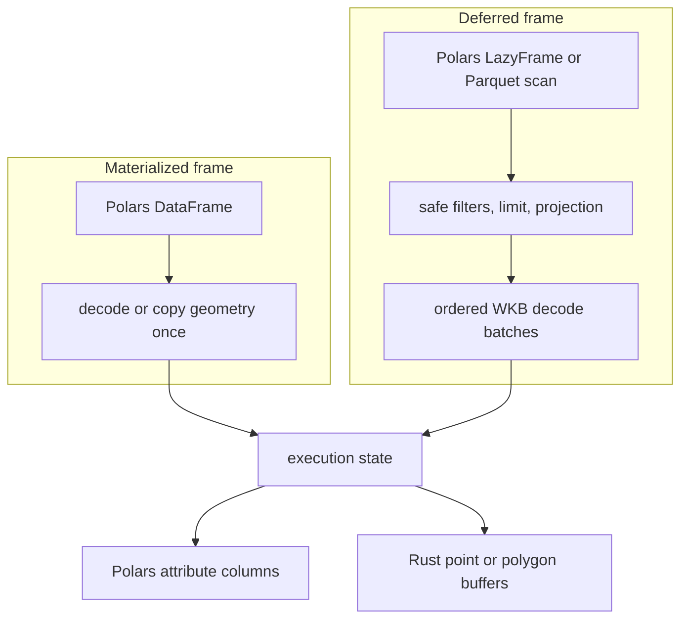
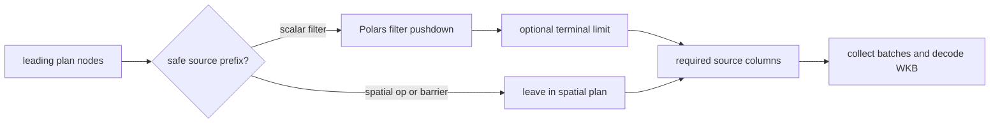
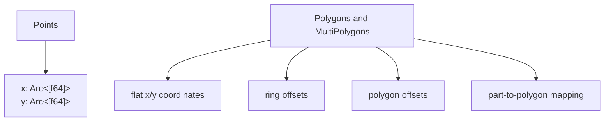

# Data Ingestion and Ownership

`SpatialFrame` has two source modes. Both produce the same execution state: aligned Polars
attributes plus native Rust geometry.

## Materialized sources

- Coordinate columns build a point engine from contiguous x/y arrays
- Point WKB is decoded into x/y arrays and retained in the DataFrame unless the caller drops it
- Polygon WKB is decoded into native coordinate and offset arrays
- Shapely and GeoArrow polygon inputs are normalized into the same native representation
- The caller's original DataFrame is never modified

## Deferred sources

- `from_lazy()` accepts a Polars `LazyFrame` containing Binary WKB
- `scan_parquet()` creates the same lazy source from local paths, globs, path lists, or cloud URLs
- GeoParquet metadata can supply the geometry column and point/polygon kind
- Nothing is decoded and no engine exists until a terminal operation prepares the plan

## What is pushed into the source

- A leading sequence of supported scalar expressions
- An optional `limit()` immediately after that sequence
- Columns required by filters, joins, and the terminal `select()` or `count()`
- Geometry for every row that reaches native materialization

Unsupported, derived, or geometry-dependent expressions remain in the spatial plan. Pushdown is
conservative: failing to recognize an expression changes performance, not results.

## Geometry representation

- Flat arrays avoid one Python or Rust object per geometry
- Offset arrays represent variable-length rings and polygon parts
- Point coordinate buffers can be shared by scan and grid paths
- Derived polygon subsets copy compact native geometry rather than decoding WKB again

## Memory boundary

!!! important
    A deferred frame is deferred ingestion, not a permanently streaming spatial engine. Collection
    builds the complete native geometry dataset before spatial execution.

- Batch decoding avoids requiring one large Python geometry-object array
- Selected attribute columns remain in Polars
- WKB batches can be released after decode unless geometry is selected in the output
- A blocking operation already present in the supplied Polars `LazyFrame` may materialize its own
  input before PyCanopy receives batches
