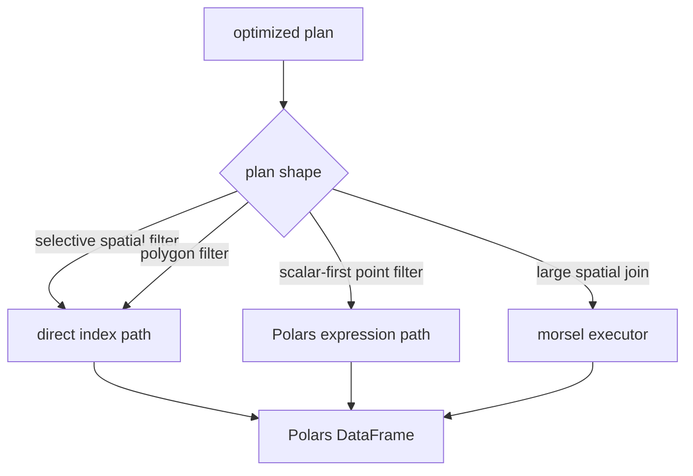
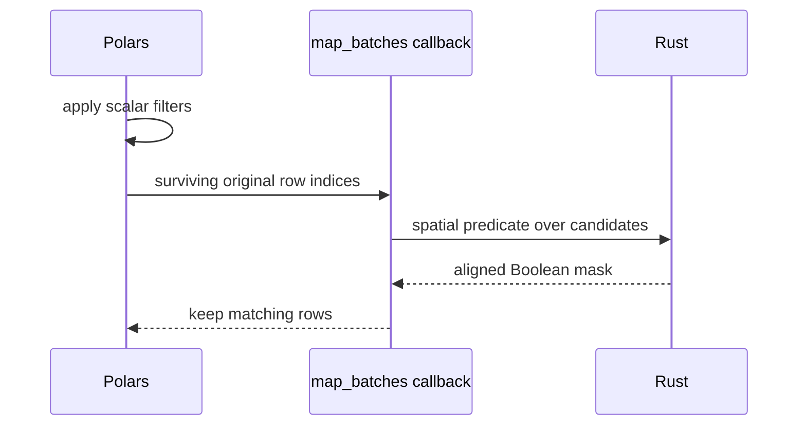
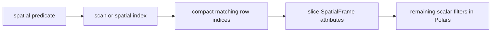
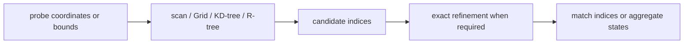
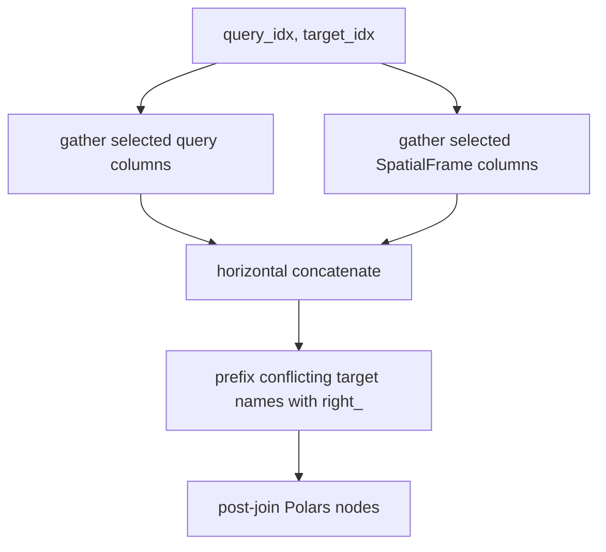
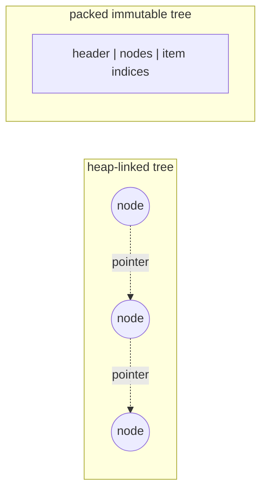

# Physical Execution

The executor translates an optimized spatial plan into Polars operations and native Rust calls.
For non-join filters, it chooses how spatial matches are connected back to Polars rows.

## Expression path

Use Polars to reduce the candidate rows before native spatial evaluation:

- The DataFrame receives a temporary original-row index
- Scalar Polars expressions run first
- `map_batches` passes only surviving row indices across the boundary
- Rust evaluates point spatial predicates over those candidates
- No temporary spatial index is built over the filtered subset

This is a Python callback integrated into a Polars lazy expression, not a native Polars expression
plugin.

## Direct index path

Use the complete native engine first when the spatial predicate is selective:

- Multiple spatial hit lists are intersected before gathering rows
- Scalar filters run over the smaller spatial result
- Polygon filters use this path because their native geometry is not represented as Polars
  coordinate columns
- kNN without a preceding scalar filter also queries the complete engine directly

The path decision controls Polars integration. The native cost model independently decides whether
the engine scans, reuses an index, or builds one.

## Native kernel pipeline

- Bounds and indexes remove geometries that cannot match
- Point-in-polygon uses prepared polygon bands for exact containment
- Polygon distance and kNN refine bounding-box candidates with exact geometry distance
- Supported aggregate kernels update group states without emitting every pair
- Long-running pure Rust sections use Rayon and release the Python GIL

## Join assembly

Rust kernels return compact query-side and target-side indices:

Projection planning narrows each gather before it happens. This matters because pair-index arrays
are usually much smaller than copying unused columns for every match.

## Packed in-memory structures

- `geo-index` KD-trees and R-trees store traversal data in contiguous packed buffers
- Point coordinates live in Rust-owned `Arc<[f64]>` arrays
- Scan and grid paths share those coordinate allocations
- KD-trees retain shared coordinates for exact distance refinement and own packed traversal data
- Polygon rings and parts use flat coordinate arrays plus offsets instead of nested objects

## Boundary crossings and copies

- Coordinate constructors normalize inputs to contiguous NumPy arrays and copy once into Rust-owned
  storage
- Standard point WKB and polygon WKB are decoded from Arrow buffers without creating one Python
  geometry object per row
- Native kernels return arrays of indices, masks, distances, or aggregates
- Read-only engine coordinate views can be exposed to NumPy and Polars without another coordinate
  copy

“Zero-copy” applies to specific shared buffers, not the entire query. Row gathers, index builds,
some input normalization, and final result construction still allocate memory.
