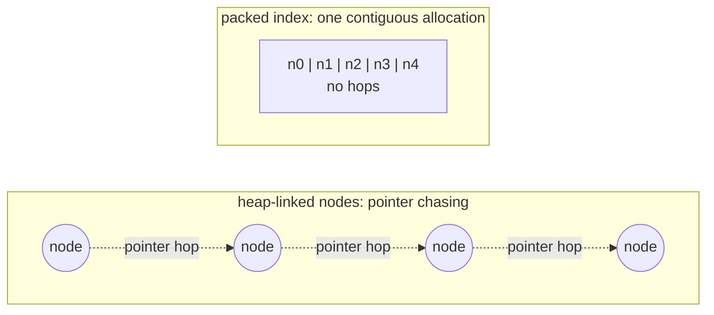
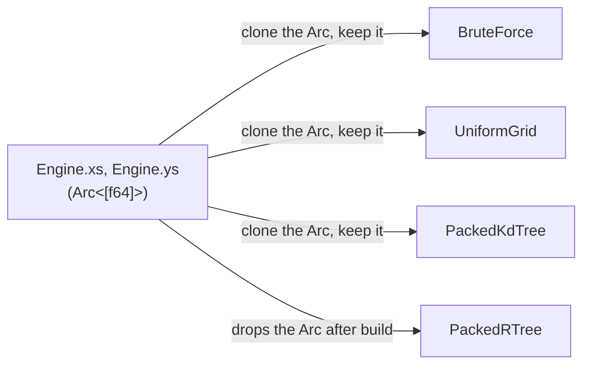
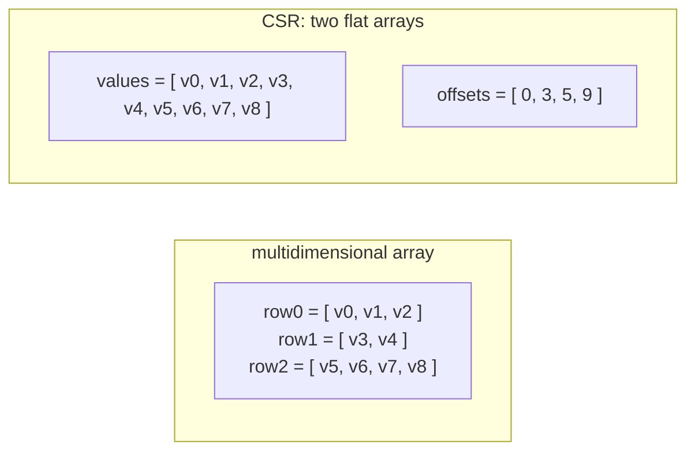

# In-Memory Optimization

A core design philosophy behind this library is to ingest, store, and query data in a way that is built for in-memory performance.

## Packed indexes

`PackedKdTree` and `PackedRTree` wrap `geo-index`, storing each index as one contiguous array instead of heap-linked nodes. This offers better cache locality and avoids expensive pointer chasing (but changes to data are more expensive).

## Shared coordinate buffer among index types

`Engine` holds `xs: Arc<[f64]>` and `ys: Arc<[f64]>` exactly once. Cloning Arc objects avoid copying the underlying data by using reference counting.

## Sparse representations

Every two-level relationship (rings in a polygon, points in a grid cell, edges in a band) is stored as one flat value array plus one offset array (rather than `Vec<Vec<T>>`) to improve cache locality.

Used for:

- polygon rings (`ring_offsets` into `xs`/`ys`, `poly_offsets` into rings)
- `UniformGrid` cells (`cell_offsets` into `indices`)
- `PreparedPolygons` Y-bands (`band_ptr` into `band_edges`, `edge_base` into `edge_verts`)
- MultiPolygon parts (`polygon_parts_csr`, part indices grouped by logical polygon)

## Polygon kNN join: spatial tiling + Z-order

A query with a large set of points sees huge cache locality benefits from spatially clustering its points, so `par_knn_to_polygons` sorts the queries by Morton (Z-order) code and groups them into a 16x16 tile grid before running kNN.
