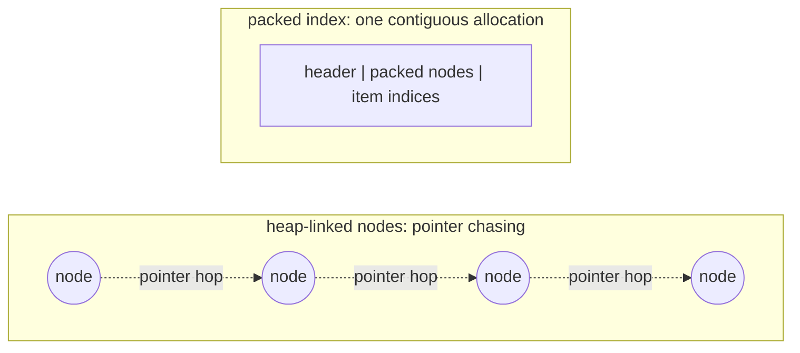
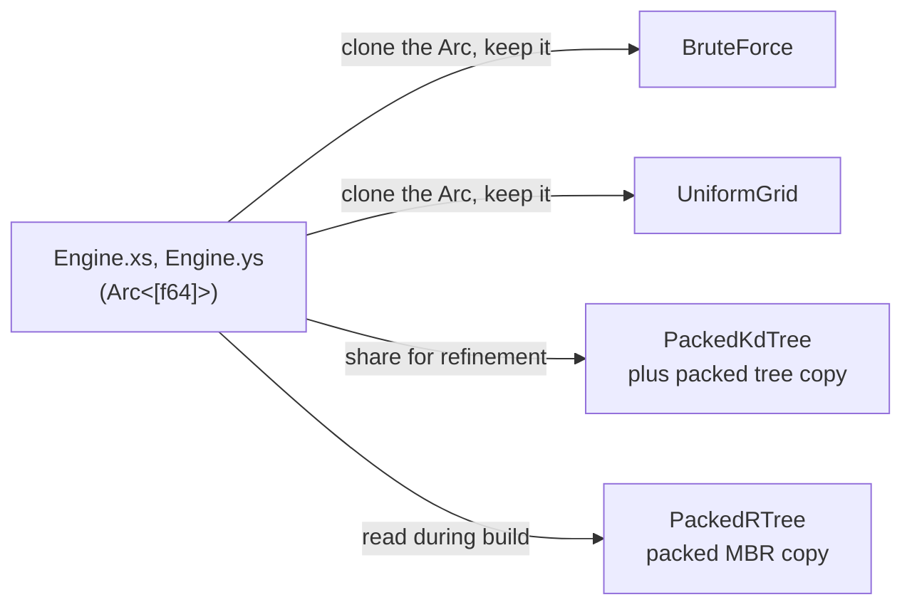
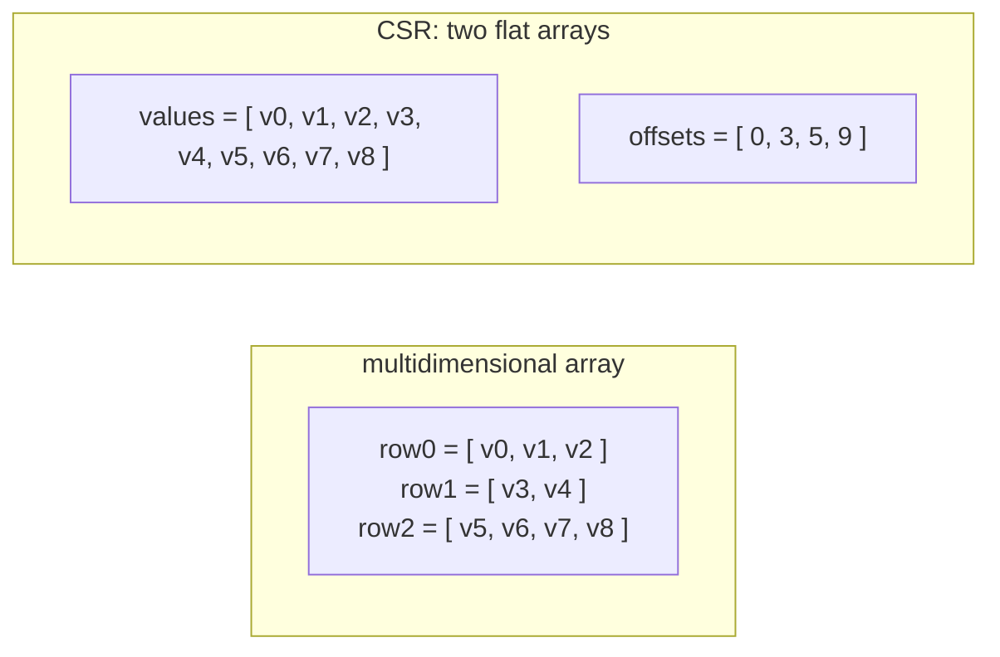

# In-Memory Design

PyCanopy uses flat buffers and immutable spatial indexes to reduce pointer chasing in its
in-memory query paths.

## Packed indexes

Each `geo-index` KD-tree or R-tree owns one contiguous `Vec<u8>` containing packed tree
data and item indices. Traversal reads offsets into this buffer instead of following
separately allocated nodes.

Packed refers only to the tree buffer. The KD-tree also retains the engine coordinates
for distance refinement; the R-tree stores its own bounding-box representation.

```mermaid
flowchart LR
    subgraph Linked["heap-linked nodes: pointer chasing"]
        direction LR
        A(("node")) -.pointer hop.-> B(("node"))
        B -.pointer hop.-> C(("node"))
        C -.pointer hop.-> D(("node"))
    end
    subgraph Packed["packed index: one contiguous allocation"]
        direction LR
        Buf["header | packed nodes | item indices"]
    end
```

## Shared coordinate buffers

`Engine` stores point coordinates in `Arc<[f64]>` buffers. Brute force and grid share
them, while the KD-tree retains them for distance refinement. Cloning an `Arc` does not
copy the coordinate array.

```mermaid
flowchart LR
    E["Engine.xs, Engine.ys<br/>(Arc&lt;[f64]&gt;)"]
    E -->|clone the Arc, keep it| B["BruteForce"]
    E -->|clone the Arc, keep it| G["UniformGrid"]
    E -->|share for refinement| K["PackedKdTree<br/>plus packed tree copy"]
    E -->|read during build| R["PackedRTree<br/>packed MBR copy"]
```

## Sparse representations

Variable-length relationships use flat value and offset arrays, allowing each group to be
read as a slice without persistent nested vectors.

```mermaid
flowchart LR
    subgraph NonCSR["multidimensional array"]
        direction TB
        M["row0 = [ v0, v1, v2 ]<br/>row1 = [ v3, v4 ]<br/>row2 = [ v5, v6, v7, v8 ]"]
    end
    subgraph CSR["CSR: two flat arrays"]
        direction TB
        F0["values = [ v0, v1, v2, v3, v4, v5, v6, v7, v8 ]"]
        F1["offsets = [ 0, 3, 5, 9 ]"]
    end
```

Used for:

- polygon rings (two coordinate arrays plus `ring_offsets` into coordinates and
  `poly_offsets` into rings)
- `UniformGrid` cells (`cell_offsets` into `indices`)
- `PreparedPolygons` Y-bands (`band_ptr` into `band_edges`, `edge_base` into `edge_verts`)
- MultiPolygon parts when an operation needs grouped lookup (`polygon_parts_csr` is built
  temporarily from the engine's persistent `part_poly` mapping)

## Geometry ownership and subsets

Polygon WKB is an ingestion format rather than the engine's retained geometry. The Rust decoder
creates the coordinate and offset arrays above, and `SpatialFrame.from_wkb_polygons` drops its WKB
column reference. The caller's input DataFrame is not modified and continues to own WKB if the
caller retains it.

Derived polygon frames copy matching native geometry into compact arrays. They do not gather and
decode WKB again. Existing indexes are not copied because their item positions refer to the source
arrays. The subset inherits the source index policy and builds a smaller index on demand when that
policy selects one.

Point frames currently retain their tabular coordinate columns alongside the Rust coordinate
buffers. Frames constructed from WKB points also retain the WKB column unless the caller projects
it out.

## Polygon kNN join: spatial tiling and Z-order

Polygon kNN joins with at least 1,024 query points use Morton ordering and a 16x16 tile
grid. Nearby probes execute together, encouraging reuse of polygon data in cache. Standard
results return to query order; globally sorted queries merge sorted per-tile runs.
