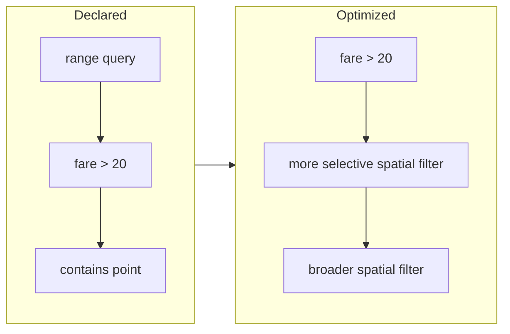
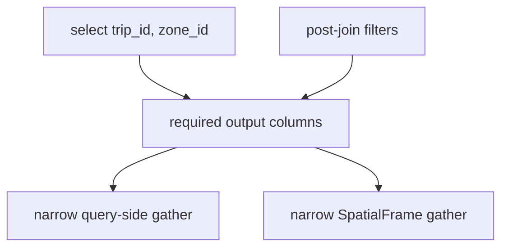

# Spatial Query Planning

Every `SpatialLazyFrame` method appends an immutable node. Declaration order is the input to the
optimizer, not necessarily execution order.


## Plan nodes

| Category | Examples | Reordering behavior |
|:---------|:---------|:--------------------|
| Scalar | `filter()` | Reordered within its barrier-separated section |
| Spatial filter | `range_query()`, `contains()` | Ordered by estimated selectivity |
| Nearest neighbour | `knn()` | Barrier |
| Spatial join | `within_join()`, `knn_join()` | Barrier |
| Terminal shape | `select()`, `count()`, `limit()` | Preserved at the plan boundary |

## Predicate ordering



- Scalar expressions run before spatial filters in a reorderable section
- Scalar expressions use a small structural cost estimate based on their Polars expression tree
- Spatial filters use extent- or histogram-based selectivity estimates
- Filters never move across kNN, join, self-join, or limit barriers
- This ordering is heuristic and separate from the calibrated native index cost model

## Spatial filter fusion

Compatible range and containment filters can share one Rust boundary crossing:


- Fusion applies only to eligible consecutive spatial filters
- Very selective filters stay separate because early reduction is more valuable than fusion
- Small datasets skip fusion because the additional planning and intersection work does not pay

## Projection planning

A terminal `select()` is traced backward through the plan:



- Join inputs retain only requested output columns and columns needed by later filters
- Deferred sources scan only the source-side columns needed to execute the remaining plan
- `count()` retains no output attributes, though filter inputs and geometry are still required

## Join orientation

- Symmetric point joins may flip based on the relative side sizes
- Supported point-to-polygon distance kernels compare forward index work with building a grid over
  the point side
- Existing indexes count as already built when native planning compares orientations
- Joins without a safe reverse kernel preserve their declared orientation

## Reading `.explain()`

```text
RANGE_QUERY [(-10, 35) → (40, 70)]
FROM
  FILTER [(col("population")) > (dyn int: 100000)]
  FROM
    DF [N=100,000; path: EXPR]
```

- The outermost operation appears first and the source appears last
- A materialized frame shows the optimized physical plan and selected execution path
- A deferred frame shows its logical plan because row statistics and the native engine do not exist
  until collection
