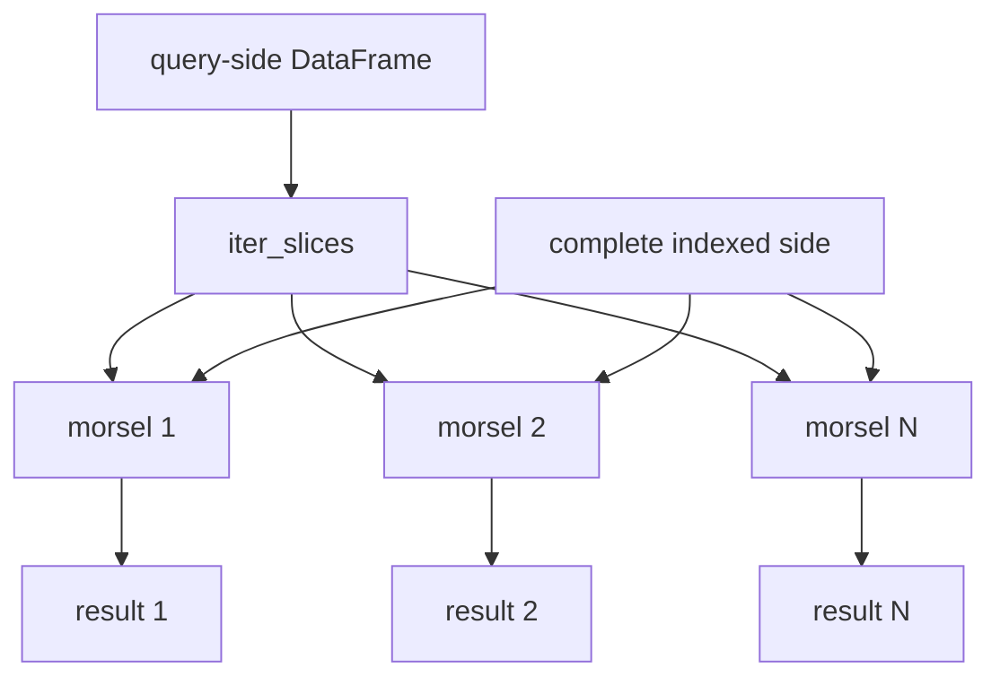
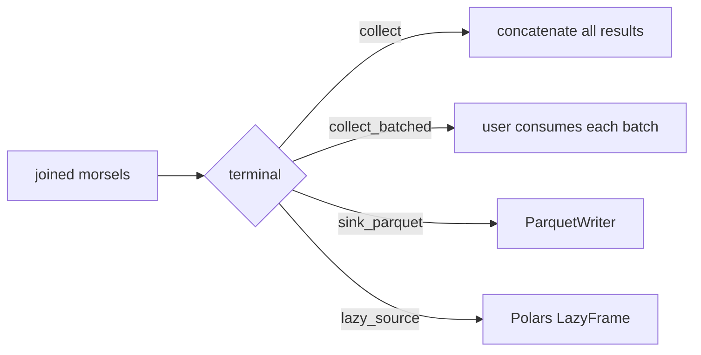
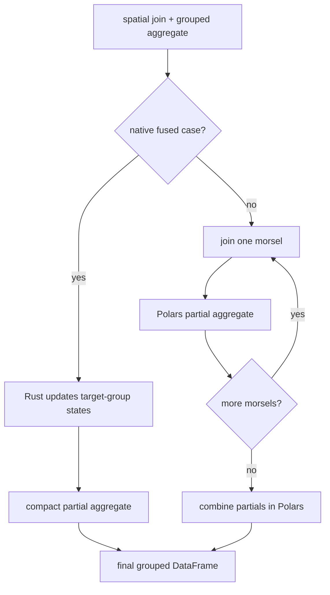

# Morsel Execution and Aggregation

Supported spatial joins divide the query-side DataFrame into fixed-size slices called morsels.
Every morsel probes the complete `SpatialFrame` engine independently.



## Why morsels

- Bound the query-side coordinates passed to a native join kernel
- Bound pair indices and gathered columns to one probe slice at a time
- Apply post-join filters and projections before advancing to the next slice
- Feed incremental consumers without assembling the complete pair frame
- Preserve total probe count so native planning does not mistake one morsel for the whole workload

Polars `iter_slices` reuses the query DataFrame's underlying buffers. The default morsel size is an
execution policy and can be overridden with `batch_size`.

## Result terminals

| Terminal | Result behavior | Complete output retained? |
|:---------|:----------------|:--------------------------|
| `collect()` | Execute morsels and concatenate their DataFrames | Yes |
| `collect_batched()` | Yield one result DataFrame per morsel | No |
| `sink_parquet()` | Write each result morsel through PyArrow | No |
| `lazy_source()` | Expose morsels through a Polars Python IO source | Controlled by downstream Polars plan |



### Batched consumption

```python
for batch in zones.lazy().within_join(trips, "lon", "lat").collect_batched():
    process(batch)
```

### Direct Parquet output

```python
zones.lazy().polygon_knn_join(trips, "lon", "lat", k=5).sink_parquet("nearest.parquet")
```

### Downstream Polars plan

```python
(
    zones.lazy()
    .polygon_knn_join(trips, "lon", "lat", k=5)
    .select("trip_id", "zone_id", "distance_to_polygon")
    .lazy_source()
    .filter(pl.col("distance_to_polygon") < 100)
    .sink_parquet("nearby.parquet")
)
```

- Predicate, projection, and row-limit requests from Polars are applied to emitted morsels
- A one-row execution establishes the source schema before Polars starts the downstream plan
- Downstream operations may stream, spill, or materialize according to Polars' own execution rules

## Grouped aggregation

`group_by(...).agg(...)` has two execution strategies:



### Fused native aggregation

- Applies to a single point-in-polygon or point-to-polygon-distance join
- Grouping keys must come from the target polygon frame
- Supports count, sum, and mean over eligible query-side numeric columns
- Accumulates group states in Rust without constructing match-pair rows

### Per-morsel aggregation

- Covers other supported aggregate shapes and includes min and max
- Reduces each joined morsel to a much smaller partial DataFrame
- Combines partial counts, sums, minima, maxima, and mean components at the end
- Never retains the complete pair frame

## Memory guarantees and limits

!!! important
    Morsel execution bounds one join batch, not every allocation in the query.

- `collect()` still retains completed morsels and the final concatenated output
- A high-fan-out join can make one morsel large
- Grouped partial memory grows with group count and morsel count
- `lazy_source()` delegates blocking behavior such as global sorting to Polars
- `polygon_knn_join(sorted_output=True)` intentionally runs the complete probe and global sort in
  Rust, bypassing morsel execution
- The indexed `SpatialFrame` side remains fully materialized for every morsel
